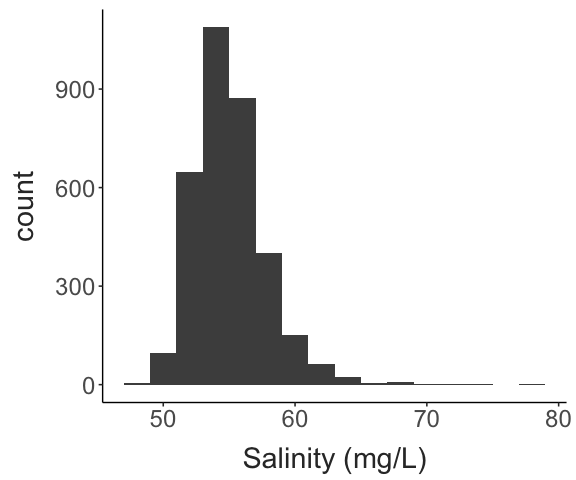

Temperature and Salinity in Lake Champlain
================
2023-10-02

- [Acquiring environmental data](#acquiring-environmental-data)
- [Seasonal patterns](#seasonal-patterns)
- [Matt’s recommendation](#matts-recommendation)

To start the project, we examine patterns in environmental conditions in
Lake Champlain to help pick levels of salinity exposure to use in the
experiment. This report:

1.  Pulls temperature and conductivity data from the USGS sensor in Lake
    Champlain from near where copepods are regularly collected (averaged
    to daily values).
2.  Converts conductivity values to salinity values that are easier to
    use for planning.
3.  Displays climatology plots for temperature and salinity, and a
    correlation plot for these two factors.
4.  Displays the distribution of salinity values observed, with possible
    treatment levels.

## Acquiring environmental data

The USGS maintains a continuous data record near Burlington Fishing
Pier, where we’ve been collecting copepods for the past several months.
This sensor records both temperature and specific conductivity. All
available data is retrieved using the following R code.

``` r
#### Load the data ####
# Site code = 04294500 (this is the site in Lake Champlain near Burlington)
# Parameter code = 00010 (water temperature in degrees C)
# Parameter code = 00095 (specific conductivity at 25C)
# Service should be dv to get daily averaged values

siteNumber = "04294500"
parameterCd = c("00010", "00095")
startDate = ""
endDate = ""

url = constructNWISURL(siteNumbers = siteNumber, parameterCd = parameterCd, 
                       startDate = startDate, endDate = endDate, service = "dv")

env_data = importWaterML1(url, asDateTime = T, tz = "America/New_York") %>%  
  mutate("date" = as.Date(dateTime)) %>%  
  select(date, "temp" = X_00010_00003, "cond" = X_00095_00003) %>% 
    drop_na(temp, cond) %>% 
  mutate(doy = yday(date)) %>% 
  mutate(psu = ((cond / 1000)^1.0878) * 0.4665, #Converts from conductivity to psu
         mgL = psu * 1000) #Converts from psu to mg per L (this is an approximation)
```

Data for a total of 3270 days is available, covering a period of time
spanning from October 01, 2014 to October 01, 2023.

## Seasonal patterns

Shown below are the plots showing the seasonal patterns in temperature
and salinity. The temperature plot highlights that Lake Champlain is
highly seasonal, with a \>20°C difference in temperature between Winter
and Summer.

The salinity plot shows a different seasonal pattern, with slight
increases in both winter and summer. These increases may be driven by
different processes: increased salt input to the lake during Winter, and
increased evaporative water loss during the Summer. Note that the
highest observed salinity values are observed during the Winter.

``` r

#Temperature climatology
temp_plot = ggplot(env_data, aes(x = doy, y = temp)) + 
  geom_point(alpha = 0.2, colour = "grey30") + 
  geom_smooth(colour = "black", linewidth = 2) + 
  labs(x = "", 
       y = "Temperature (°C)") + 
  theme_matt()

#Salinity climatology
sal_plot = ggplot(env_data, aes(x = doy, y = mgL)) + 
  geom_point(alpha = 0.2, colour = "grey30") + 
  geom_smooth(colour = "black", linewidth = 2) + 
  labs(x = "Day of Year", 
       y = "Salinity (mg/L)") + 
  theme_matt()

ggarrange(temp_plot, sal_plot, nrow = 2)
```


The correlation between temperature and salinity is weakly positive, but
again we see that the highest salinity values occur when water
temperatures are low. If we restrict the correlation to just days where
temperature is below 10°C, we see that there is generally no
relationship between salinity and temperature. The overall average
salinity is included in this restricted plot in red.

This suggests that Lake Champlain during the winter is largely
characterized by stable salinities, with a small number of relatively
extreme events.

``` r

#Correlations
ggplot(env_data, aes(x = temp, y = mgL)) + 
  geom_point(alpha = 0.3, colour = "grey30") + 
  geom_smooth(colour = "black", linewidth = 2) + 
  labs(x = "Temperature (°C)", 
       y = "Salinity (mg/L)") + 
  theme_matt()
```


``` r

### Summer increase in conductivity driven by increasing evaporation / decreasing input? 
env_data %>% 
  filter(temp < 10) %>% 
ggplot(aes(x = temp, y = mgL)) + 
  geom_hline(yintercept = mean(env_data$mgL, na.rm = T), linewidth = 2, colour = "sienna3") + 
  geom_point(alpha = 0.2, colour = "grey30") + 
  geom_smooth(colour = "black", linewidth = 2) + 
  labs(x = "Temperature (°C)", 
       y = "Salinity (mg/L)") + 
  theme_matt()
```


The distribution of daily salinity values is shown below, along with
vertical lines indicating the 50th, 75th, 90th, and 99th percentiles for
winter days (water temperatures below 10°C). These quartile values would
be strong candidates for **environmentally realistic** levels of
salinity exposures.

``` r
winter_vals = env_data %>% 
  filter(temp <= 10)

sal_quants = quantile(winter_vals$mgL, probs = c(0.5, 0.75, 0.9, 0.99), na.rm = T)

ggplot(env_data, aes(x = mgL)) + 
  geom_histogram(binwidth = 2, 
                 fill = "grey30") + 
  geom_vline(xintercept = sal_quants, colour = "steelblue3", linewidth = 1) + 
  labs(x = "Salinity (mg/L)") + 
  theme_matt()
```



## Matt’s recommendation

Collect copepods, and separate into two groups (n = 20 each).

One group remains at control (standard salinity), while the other is
acclimated to a mild salinity treatment (the 75th quartile value).

After one week of acclimation, thermal limits are measured in either
standard conditions or under salinity stress (90th or 99th percentile).
These measurements are made over 3 replicate assays, with individuals
randomly assigned to control or salt treatments from the two acclimation
groups.

30 individuals per experiment (n = 10 per replicate); 15 individuals per
acclimation treatment; 7-8 individuals per assay treatment.

By repeating the experiment three times, both technical and biological
replication will be robust. In total, the project would take
approximately 4-6 weeks.
