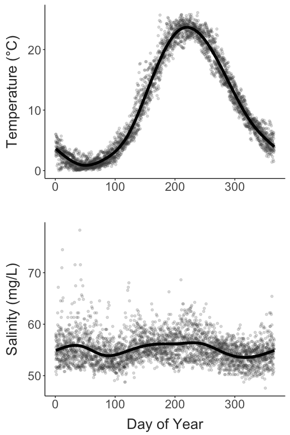
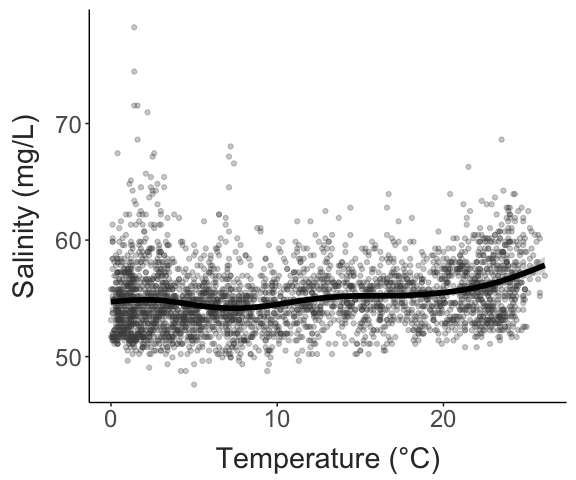
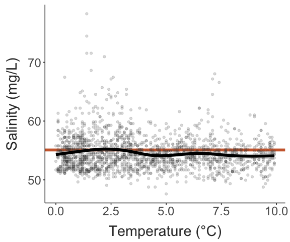
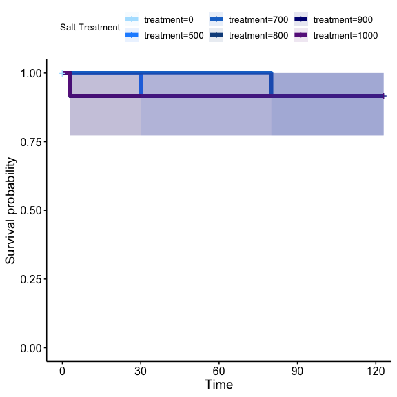
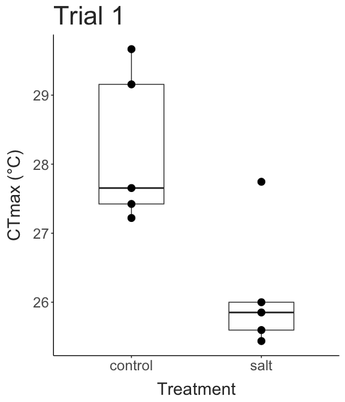

Preliminary Report
================
2023-12-19

- [Temperature and Salinity in Lake
  Champlain](#temperature-and-salinity-in-lake-champlain)
  - [Acquiring environmental data](#acquiring-environmental-data)
  - [Seasonal patterns](#seasonal-patterns)
- [Preliminary Survival Experiment](#preliminary-survival-experiment)
  - [Survival Analysis](#survival-analysis)
  - [CTmax Analysis](#ctmax-analysis)

## Temperature and Salinity in Lake Champlain

To start the project, we examine patterns in environmental conditions in
Lake Champlain to help pick levels of salinity exposure to use in the
experiment. This report:

1.  Pulls temperature and conductivity data from the USGS sensor in Lake
    Champlain from near where copepods are regularly collected (averaged
    to daily values).
2.  Converts conductivity values to salinity values that are easier to
    use for planning.
3.  Displays climatology plots for temperature and salinity, and a
    correlation plot for these two factors.
4.  Displays the distribution of salinity values observed, with possible
    treatment levels.

### Acquiring environmental data

The USGS maintains a continuous data record near Burlington Fishing
Pier, where we’ve been collecting copepods for the past several months.
This sensor records both temperature and specific conductivity. All
available data is retrieved using the following R code.

``` r
#### Load the data ####
# Site code = 04294500 (this is the site in Lake Champlain near Burlington)
# Parameter code = 00010 (water temperature in degrees C)
# Parameter code = 00095 (specific conductivity at 25C)
# Service should be dv to get daily averaged values

siteNumber = "04294500"
parameterCd = c("00010", "00095")
startDate = ""
endDate = ""

url = constructNWISURL(siteNumbers = siteNumber, parameterCd = parameterCd, 
                       startDate = startDate, endDate = endDate, service = "dv")

env_data = importWaterML1(url, asDateTime = T, tz = "America/New_York") %>%  
  mutate("date" = as.Date(dateTime)) %>%  
  select(date, "temp" = X_00010_00003, "cond" = X_00095_00003) %>% 
    drop_na(temp, cond) %>% 
  mutate(doy = yday(date)) %>% 
  mutate(mgL = cond * 0.292) # State equation to convert continuous conductivity measurements to chloride concentrations: VT DEC 2019 - Watershed Management Division. Vermont Surface Water Assessment and Listing Methodology in accordance with USEPA Guidance. Montpelier www.watershedmanagement.vt.gov
```

Data for a total of 3348 days is available, covering a period of time
spanning from October 01, 2014 to December 18, 2023.

### Seasonal patterns

Shown below are the plots showing the seasonal patterns in temperature
and salinity. The temperature plot highlights that Lake Champlain is
highly seasonal, with a \>20°C difference in temperature between Winter
and Summer.

The salinity plot shows a different seasonal pattern, with slight
increases in both winter and summer. These increases may be driven by
different processes: increased salt input to the lake during Winter, and
increased evaporative water loss during the Summer. Note that the
highest observed salinity values are observed during the Winter.

``` r

#Temperature climatology
temp_plot = ggplot(env_data, aes(x = doy, y = temp)) + 
  geom_point(alpha = 0.2, colour = "grey30") + 
  geom_smooth(colour = "black", linewidth = 2) + 
  labs(x = "", 
       y = "Temperature (°C)") + 
  theme_matt()

#Salinity climatology
sal_plot = ggplot(env_data, aes(x = doy, y = mgL)) + 
  geom_point(alpha = 0.2, colour = "grey30") + 
  geom_smooth(colour = "black", linewidth = 2) + 
  labs(x = "Day of Year", 
       y = "Salinity (mg/L)") + 
  theme_matt()

ggarrange(temp_plot, sal_plot, nrow = 2)
```



The correlation between temperature and salinity is weakly positive, but
again we see that the highest salinity values occur when water
temperatures are low. If we restrict the correlation to just days where
temperature is below 10°C, we see that there is generally no
relationship between salinity and temperature. The overall average
salinity is included in this restricted plot in red.

This suggests that Lake Champlain during the winter is largely
characterized by stable salinities, with a small number of relatively
extreme events.

``` r

#Correlations
ggplot(env_data, aes(x = temp, y = mgL)) + 
  geom_point(alpha = 0.3, colour = "grey30") + 
  geom_smooth(colour = "black", linewidth = 2) + 
  labs(x = "Temperature (°C)", 
       y = "Salinity (mg/L)") + 
  theme_matt()
```



``` r

### Summer increase in conductivity driven by increasing evaporation / decreasing input? 
env_data %>% 
  filter(temp < 10) %>% 
ggplot(aes(x = temp, y = mgL)) + 
  geom_hline(yintercept = mean(env_data$mgL, na.rm = T), linewidth = 2, colour = "sienna3") + 
  geom_point(alpha = 0.2, colour = "grey30") + 
  geom_smooth(colour = "black", linewidth = 2) + 
  labs(x = "Temperature (°C)", 
       y = "Salinity (mg/L)") + 
  theme_matt()
```



## Preliminary Survival Experiment

To select salinity treatments for the full experiment we ran a 4 day
survival test, with copepods exposed to a range of salinities (0 mg/L -
1000 mg/L added to bottled spring water). Survival was checked
approximately every 24 hours. After four days, upper thermal limits (as
CTmax) were measured for five copepods each from the control and 1000
mg/L salinity treatment.

``` r
recipe = data.frame(desired = seq(from = 0, to = 1000, by = 100)) %>% 
  mutate(salt_added = (desired * 30) / 2000)
```

### Survival Analysis

Survival was high across all treatments, with minimal mortality in the
highest salinity treatments.

``` r
surv_data = prelim_surv %>% 
  filter(!(treatment %in% c("half", "RO"))) %>% 
  mutate(treatment = as.numeric(treatment)) %>% 
  pivot_longer(cols = starts_with("hour_"),
               values_to = "surv", 
               names_to = "hour",
               names_prefix = "hour_") %>% 
  group_by(treatment) %>% 
  mutate(initial = first(surv)) %>% ### REMOVE THIS LINE AT END
  group_by(treatment, hour) %>% 
  drop_na(surv) %>% 
  mutate(hour = as.numeric(hour),
         "ind_surv" = paste(rep(c(0,1), c(surv, initial - surv)), collapse = ",")) %>%
  select(-surv, -initial) %>% 
  separate_rows(ind_surv, sep = ",", convert = T) %>% 
  mutate("ID" = row_number()) %>%  
  ungroup() %>% 
  group_by(treatment, ID) %>% 
  filter(ind_surv == 1 | treatment == 0) %>% 
  filter(hour == min(hour)) %>% 
  ungroup() %>% 
  complete(treatment,ID, 
           fill = list(hour = 123,
                       ind_surv = 0))

surv_obj = Surv(surv_data$hour, surv_data$ind_surv)

surv_fit = survfit2(Surv(hour, ind_surv) ~ treatment, data = surv_data)

#summary(surv_fit)

ggsurvplot(surv_fit, 
           conf.int=T, pval=F, risk.table=F, 
           conf.int.alpha = 0.1,
           size = 2,
           legend.title="Salt Treatment",
           palette=c("lightskyblue1", "dodgerblue","dodgerblue3", "dodgerblue4", "navy", "darkorchid4", "lightsalmon", "indianred2", "indianred4", "orangered3", "firebrick4"))
```



``` r
cox.model = coxph(Surv(hour, ind_surv) ~ treatment, data = surv_data)

cox.model
## Call:
## coxph(formula = Surv(hour, ind_surv) ~ treatment, data = surv_data)
## 
##                coef exp(coef)  se(coef)     z     p
## treatment 9.405e-05 1.000e+00 2.604e-03 0.036 0.971
## 
## Likelihood ratio test=0  on 1 df, p=0.9712
## n= 72, number of events= 5
```

### CTmax Analysis

``` r
trial_ctmax = est_ctmax(test_temp, test_time)

ggplot(trial_ctmax, aes(x = treatment, y = ctmax)) + 
  geom_boxplot(width = 0.3) +
  geom_point(size = 4) + 
  labs(x = "Treatment", 
       y = "CTmax (°C)") + 
  theme_matt()
```


