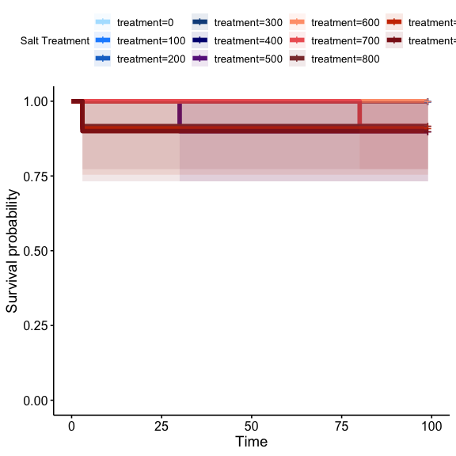
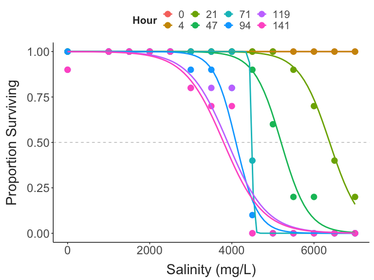
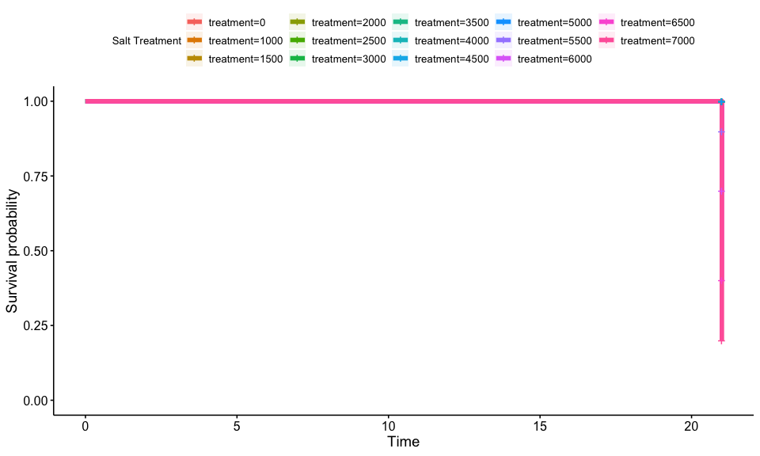

Preliminary Report
================
2024-01-13

- [Temperature and Salinity in Lake
  Champlain](#temperature-and-salinity-in-lake-champlain)
  - [Acquiring environmental data](#acquiring-environmental-data)
  - [Seasonal patterns](#seasonal-patterns)
- [Preliminary Survival Experiments](#preliminary-survival-experiments)
  - [Survival Analysis](#survival-analysis)
  - [CTmax Analysis](#ctmax-analysis)

## Temperature and Salinity in Lake Champlain

To provide context for this project, we begin by examining patterns in
temperature and salinity in Lake Champlain.

### Acquiring environmental data

The USGS maintains a continuous data record near Burlington Fishing
Pier, where copepods were collected. This sensor records both
temperature and specific conductivity.

``` r
#### Load the data ####
# Site code = 04294500 (this is the site in Lake Champlain near Burlington)
# Parameter code = 00010 (water temperature in degrees C)
# Parameter code = 00095 (specific conductivity at 25C)
# Service should be dv to get daily averaged values

siteNumber = "04294500"
parameterCd = c("00010", "00095")
startDate = ""
endDate = ""

url = constructNWISURL(siteNumbers = siteNumber, parameterCd = parameterCd, 
                       startDate = startDate, endDate = endDate, service = "dv")

env_data = importWaterML1(url, asDateTime = T, tz = "America/New_York") %>%  
  mutate("date" = as.Date(dateTime)) %>%  
  select(date, "temp" = X_00010_00003, "cond" = X_00095_00003) %>% 
  drop_na(temp, cond) %>% 
  mutate(doy = yday(date)) %>% 
  mutate(mgL = cond * 0.292) # State equation to convert continuous conductivity measurements to chloride concentrations: VT DEC 2019 - Watershed Management Division. Vermont Surface Water Assessment and Listing Methodology in accordance with USEPA Guidance. Montpelier www.watershedmanagement.vt.gov
```

Data for a total of 3373 days is available, covering a period of time
spanning from October 01, 2014 to January 12, 2024.

### Seasonal patterns

Shown below are the plots of the seasonal patterns in temperature and
salinity. The temperature plot highlights that Lake Champlain is highly
seasonal, with a \>20°C difference in temperature between Winter and
Summer.

The salinity plot shows a different seasonal pattern, with slight
increases in both winter and summer. These increases may be driven by
different processes: increased salt input to the lake during Winter, and
increased evaporative water loss during the Summer. Note that the
highest salinity values are observed during the Winter, occuring as
infrequent, short spikes in salinity.

``` r

#Temperature climatology
temp_plot = ggplot(env_data, aes(x = doy, y = temp)) + 
  geom_point(alpha = 0.2, colour = "grey30") + 
  geom_smooth(colour = "black", linewidth = 2) + 
  labs(x = "", 
       y = "Temperature (°C)") + 
  theme_matt()

#Salinity climatology
sal_plot = ggplot(env_data, aes(x = doy, y = mgL)) + 
  geom_point(alpha = 0.2, colour = "grey30") + 
  geom_smooth(colour = "black", linewidth = 2) + 
  labs(x = "Day of Year", 
       y = "Salinity (mg/L)") + 
  theme_matt()

ggarrange(temp_plot, sal_plot, nrow = 2)
```


The correlation between temperature and salinity is weakly positive, but
again we see that the highest salinity values occur when water
temperatures are low. If we restrict the correlation to just days where
temperature is below 10°C, we see that there is generally no
relationship between salinity and temperature. The overall average
salinity is included in this restricted plot in red. This suggests that
Lake Champlain during the winter is largely characterized by stable
salinities, with a small number of relatively extreme events.

``` r

#Correlations
ggplot(env_data, aes(x = temp, y = mgL)) + 
  geom_point(alpha = 0.3, colour = "grey30") + 
  geom_smooth(colour = "black", linewidth = 2) + 
  labs(x = "Temperature (°C)", 
       y = "Salinity (mg/L)") + 
  theme_matt()
```


``` r

### Summer increase in conductivity driven by increasing evaporation / decreasing input? 
env_data %>% 
  filter(temp < 10) %>% 
  ggplot(aes(x = temp, y = mgL)) + 
  geom_hline(yintercept = mean(env_data$mgL, na.rm = T), linewidth = 2, colour = "sienna3") + 
  geom_point(alpha = 0.2, colour = "grey30") + 
  geom_smooth(colour = "black", linewidth = 2) + 
  labs(x = "Temperature (°C)", 
       y = "Salinity (mg/L)") + 
  theme_matt()
```


Shown below is the distribution of observed salinity values from the
sensor, restricted to data from days were the temperature was less than
or equal to 10°C. This distribution suggests that salinity levels are
fairly low in the lake, with the distribution centered around 55 mg/L.

## Preliminary Survival Experiments

To select salinity treatments for the full experiment we ran a multi-day
survival test, with copepods exposed to a range of salinities. The first
preliminary trial used concentrations based on the observed salinity
distribution in the lake, and the EPA guidlines on acute and extended
exposure thresholds. These values (0 mg/L - 1000 mg/L added to bottled
spring water) span the observed salinities, and extend past the EPA
thresholds.

Survival was checked approximately every 24 hours. After four days,
upper thermal limits (as CTmax) were measured for five copepods each
from the control and 1000 mg/L salinity treatment.

### Survival Analysis

Surprisingly, survival was high across all treatments in this trial,
with only minimal mortality in the highest salinity treatments.

``` r

surv_trial_1 = expand_surv(prelim_surv) %>% make_surv()
surv_obj_1 = Surv(surv_trial_1$hour, surv_trial_1$ind_surv)
surv_fit_1 = survfit2(Surv(hour, ind_surv) ~ treatment, data = surv_trial_1)

surv_trial_1  %>% 
  ungroup() %>% 
  select(-ID, -hour) %>% 
  group_by(treatment, initial) %>% 
  summarise(num_died = sum(ind_surv)) %>%  
  mutate(total_surv = initial - num_died,
         prop_surv = total_surv / initial) %>% 
  ggplot(aes(x = treatment, y = prop_surv)) + 
  geom_hline(yintercept = 0.5,
             colour = "grey", 
             linetype = "dashed") + 
  geom_point(size = 4) + 
  labs(x = "Salinity (mg/L)",
       y = "Proportion Surviving ") + 
  theme_matt()
```


``` r


#summary(surv_fit)

ggsurvplot(surv_fit_1, 
           conf.int=T, pval=F, risk.table=F, 
           conf.int.alpha = 0.1,
           size = 2,
           legend.title="Salt Treatment",
           palette=c("lightskyblue1", "dodgerblue","dodgerblue3", "dodgerblue4", "navy", "darkorchid4", "lightsalmon", "indianred2", "indianred4", "orangered3", "firebrick4"))
```



This first preliminary test suggests that *L. sicilis* has fairly high
salinity tolerance. A second preliminary test was run with a much larger
salinity range (spanning 1000 to 7000 mg salt/L). No acute mortality
(\<5 hours after the ramp up was completed) was observed, but within 24
hours there was mortality observed in some of the higher salt
concentration treatments. Note that the salinity values where mortality
occured correspond to \>5 g added salt per L water.

``` r

daily_surv_data = data.frame()

for(i in 3:dim(prelim_surv2)[2]){
  
  col_name = colnames(prelim_surv2)[i]
  hour = as.numeric(str_split_fixed(col_name, pattern = "_", n = 2)[2])
  
  day_data = prelim_surv2 %>%  
    select(treatment:{{col_name}}) %>% 
    expand_surv() %>% 
    make_surv() %>% 
    ungroup() %>% 
    group_by(treatment, initial) %>% 
    summarise(num_died = sum(ind_surv)) %>%  
    mutate(total_surv = initial - num_died,
           prop_surv = total_surv / initial,
           hour = hour)
  
  daily_surv_data = bind_rows(daily_surv_data, day_data)
}

ggplot(daily_surv_data, aes(x = treatment, y = prop_surv, colour = factor(hour))) + 
  geom_hline(yintercept = 0.5,
             colour = "grey", 
             linetype = "dashed") + 
  geom_point(size = 4) + 
  geom_smooth(method = "glm", 
              method.args = list(family = "binomial"), 
              se = FALSE) + 
  labs(x = "Salinity (mg/L)",
       y = "Proportion Surviving",
       colour = "Hour") + 
  theme_matt()
```



``` r
surv_trial_2 = expand_surv(prelim_surv2) %>% make_surv()
surv_obj_2 = Surv(surv_trial_2$hour, surv_trial_2$ind_surv)
surv_fit_2 = survfit2(Surv(hour, ind_surv) ~ treatment, data = surv_trial_2)

#summary(surv_fit_2)

ggsurvplot(surv_fit_2, 
           conf.int=T, pval=F, risk.table=F, 
           conf.int.alpha = 0.1,
           size = 2,
           legend.title="Salt Treatment")
```



``` r
cox.model_2 = coxph(Surv(hour, ind_surv) ~ treatment, data = surv_trial_2)
print(cox.model_2)
## Call:
## coxph(formula = Surv(hour, ind_surv) ~ treatment, data = surv_trial_2)
## 
##                coef exp(coef)  se(coef)     z      p
## treatment 0.0015364 1.0015376 0.0001473 10.43 <2e-16
## 
## Likelihood ratio test=200.4  on 1 df, p=< 2.2e-16
## n= 140, number of events= 69

#ggforest(cox.model_2, data = surv_trial_2)
```

### CTmax Analysis

After several days of acclimation to the new salt levels, CTmax was
measured for individual copepods. In trial 1, the control and maximum
salt concentrations were used (0 and 1000 mg/L, respectively). One CTmax
assay was performed (n = 5 per treatment), resulting in only a small
comparison. Nonetheless, no large differences in CTmax were observed.

After trial 2, CTmax was measured for control individuals and
individuals from the 3500 mg/L treatment. Survival was high in the 4000
mg/L treatment as well, but these individuals were generally inactive,
inhibiting the measurements of CTmax. Individuals from the 3500 mg/L
treatment were more active. There was a clear decrease in thermal limits
in the salt-acclimated copepods.

``` r
ctmax_data2 = est_ctmax(ctmax_temp2, ctmax_time2)

ggplot(ctmax_data2, aes(x = treatment, y = ctmax)) + 
  geom_boxplot(width = 0.5) +
  geom_point(size = 4) + 
  labs(x = "Treatment", 
       y = "CTmax (°C)") + 
  theme_matt()
```


``` r
broom::tidy(t.test(data = ctmax_data2, ctmax~treatment)) %>% 
  mutate("difference" = paste("-", round(estimate, digits = 2), " [", "-", round(conf.low, digits = 2), ",-", round(conf.high, digits = 2), "]", sep = "")) %>% 
  select("Control" = estimate1, "Salt" = estimate2, "Effect" = difference, "p-value" = p.value) %>% 
  knitr::kable(align = "c",
               digits = 2,
               format = "html")
```

<table>
<thead>
<tr>
<th style="text-align:center;">
Control
</th>
<th style="text-align:center;">
Salt
</th>
<th style="text-align:center;">
Effect
</th>
<th style="text-align:center;">
p-value
</th>
</tr>
</thead>
<tbody>
<tr>
<td style="text-align:center;">
28.22
</td>
<td style="text-align:center;">
26.13
</td>
<td style="text-align:center;">
-2.1 \[-0.6,-3.6\]
</td>
<td style="text-align:center;">
0.01
</td>
</tr>
</tbody>
</table>
