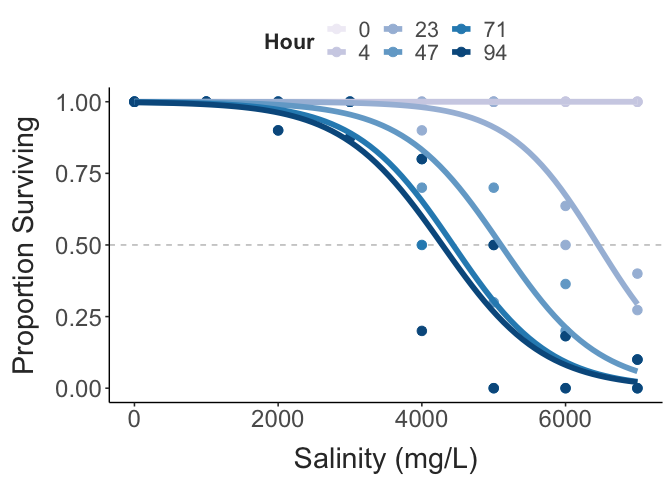
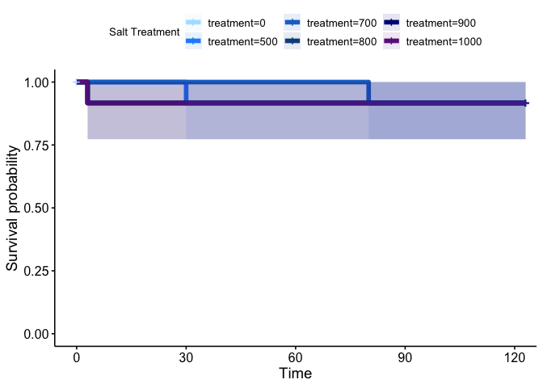

TITLE HERE
================
2024-01-18

- [Survival Analyses](#survival-analyses)
- [CTmax Data](#ctmax-data)

## Survival Analyses

``` r
ggplot(daily_prop_data, aes(x = treatment, y = prop_surv, colour = factor(hour))) + 
  geom_hline(yintercept = 0.5,
             colour = "grey", 
             linetype = "dashed") + 
  geom_point(size = 3) + 
  geom_smooth(method = "glm", 
              method.args = list(family = "binomial"), 
              se = FALSE,
              linewidth = 2) + 
  scale_colour_brewer(type = "seq", palette = 9) + 
  labs(x = "Salinity (mg/L)",
       y = "Proportion Surviving",
       colour = "Hour") + 
  theme_matt()
```



``` r
surv_obj = Surv(surv_data$hour, surv_data$ind_surv)
surv_fit = survfit2(Surv(hour, ind_surv) ~ treatment, data = surv_data)

#summary(surv_fit_2)

ggsurvplot(surv_fit, 
           conf.int=T, pval=F, risk.table=F, 
           conf.int.alpha = 0.1,
           size = 2,
           palette = "YlOrRd",
           legend.title="Salt Treatment")
```



``` r
cox.model = coxph(Surv(hour, ind_surv) ~ treatment, data = surv_data)

cox.model
## Call:
## coxph(formula = Surv(hour, ind_surv) ~ treatment, data = surv_data)
## 
##                coef exp(coef)  se(coef)     z      p
## treatment 0.0010633 1.0010639 0.0001064 9.997 <2e-16
## 
## Likelihood ratio test=177.6  on 1 df, p=< 2.2e-16
## n= 147, number of events= 66
```

## CTmax Data
