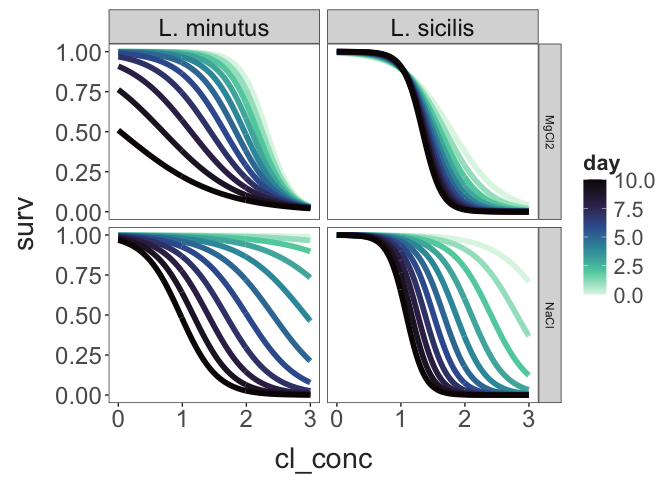

Effects of salinity acclimation on upper thermal limits of Lake
Champlain diaptomid copepods
================
2026-04-03

- [Survival Analyses](#survival-analyses)
  - [Skistodiaptomus oregonensis](#skistodiaptomus-oregonensis)
- [CTmax Data](#ctmax-data)
- [Ion Specific Patterns Across
  Seasons](#ion-specific-patterns-across-seasons)

## Survival Analyses

``` r
ggplot(daily_prop_data, aes(x = treatment, y = prop_surv, colour = factor(exp_day))) + 
  facet_wrap(salt~.) + 
  geom_hline(yintercept = 0.5,
             colour = "grey", 
             linetype = "dashed") + 
  geom_point(size = 3) + 
  geom_smooth(method = "glm", 
              method.args = list(family = "binomial"), 
              se = FALSE,
              linewidth = 2) + 
  scale_colour_brewer(type = "seq", palette = 9) + 
  guides(colour = guide_legend(nrow = 1)) + 
  labs(x = "Salinity (mg/L)",
       y = "Proportion Surviving",
       colour = "Day") + 
  theme_matt_facets() + 
  theme(legend.position = "bottom")
```


``` r
# surv_obj = Surv(surv_data$hour, surv_data$ind_surv)
# surv_fit = survfit2(Surv(hour, ind_surv) ~ treatment + salt, data = surv_data)
# 
# #summary(surv_fit_2)
# 
# ggsurvplot_facet(surv_fit, 
#                  data = surv_data,
#                  facet.by = "salt",
#                  conf.int=T, pval=F, risk.table=F, 
#                  conf.int.alpha = 0.1,
#                  size = 2,
#                  palette = "YlOrRd",
#                  legend.title="Salt Treatment")
```

### Skistodiaptomus oregonensis

``` r

oreg_data %>% 
  mutate(initial = hour_0) %>% 
  pivot_longer(cols = c("hour_0", "hour_18", "hour_42", "hour_62", "hour_86"), 
               names_to = "hour", 
               values_to = "individuals") %>% 
  mutate(prop_surv = individuals / initial) %>% 
  ggplot(aes(x = treatment, y = prop_surv, colour = sex)) +
  facet_wrap(hour~.) + 
  geom_point(position = position_jitter(height = 0.01, width = 200)) + 
  geom_smooth(method = "glm", 
              method.args = list(family = "binomial"), 
              se = FALSE,
              linewidth = 2) + 
  scale_colour_manual(values = c("female" = "lightcoral", 
                                 "male" = "lightblue3")) + 
  labs(x = "Salinity (mg/L)", 
       y = "Proportion Surviving") + 
  theme_matt_facets()
```


## CTmax Data

Shown below are the sample sizes for the various salt-treatment
combinations. Fewer experiments were run with Instant Ocean, so the
sample sizes are smaller for this salt.

``` r
ctmax_filtered = ctmax_data %>% 
  filter(!(experiment == 1 & experiment_date == "1/20/24")) %>% 
  filter(!(experiment_date == "2/3/24")) %>% 
  mutate("ID" = paste(salt, treatment, sep = " - ")) %>% 
  mutate(group = case_when(
    treatment == "control" ~ "control",
    treatment == "salt" ~ salt,
    treatment == "salt" ~ salt
  ))

knitr::kable(ctmax_filtered %>% 
               group_by(salt, treatment) %>%  
               count())
```

| salt         | treatment |   n |
|:-------------|:----------|----:|
| InstantOcean | control   |  10 |
| InstantOcean | salt      |  10 |
| RoadSalt     | control   |  20 |
| RoadSalt     | salt      |  20 |

A linear mixed effects model was used to examine variation in CTmax as a
function of salt type (Instant Ocean and road salt) and treatment
(control or salt-acclimated). We also examined the interaction between
these factors to determine whether the effect of treatment depended on
the type of salt used. Experiment date was included as a random effect
to control for any differences between collections or experimental
replicates.

``` r
salt.model = lmer(data = ctmax_filtered,
                  ctmax ~ treatment * salt + (1|experiment_date))

# salt.model = lm(data = ctmax_filtered,
#                 ctmax ~ treatment * salt)

knitr::kable(car::Anova(salt.model, type = "III"))
```

|                |       Chisq |  Df | Pr(\>Chisq) |
|:---------------|------------:|----:|------------:|
| (Intercept)    | 297.1864842 |   1 |   0.0000000 |
| treatment      |   0.9650063 |   1 |   0.3259287 |
| salt           |   0.0460898 |   1 |   0.8300127 |
| treatment:salt |  10.1836510 |   1 |   0.0014169 |

The mixed effects model indicates that there was a significant
interaction between salt type and treatment. We examined this
interaction by calculating the marginal treatment means by salt type.
Shown below, there was no significant difference between treatment
groups in the Instant Ocean experiments, but there was a substantial
difference between treatment groups in the road salt experiments.

``` r
salt.means = emmeans::emmeans(salt.model,
                              pairwise ~ treatment | salt)

knitr::kable(salt.means$contrasts)
```

| contrast       | salt         |   estimate |        SE |     df |    t.ratio |   p.value |
|:---------------|:-------------|-----------:|----------:|-------:|-----------:|----------:|
| control - salt | InstantOcean | -0.9290657 | 0.9457608 | 54.002 | -0.9823474 | 0.3303095 |
| control - salt | RoadSalt     |  2.7673322 | 0.6687539 | 54.002 |  4.1380427 | 0.0001234 |

``` r

treat_cols = c("salt" = "#95d5ce", "control" = "#028260")

ggplot(ctmax_filtered, aes(x = treatment, y = ctmax, fill = treatment)) +
  facet_wrap(salt~.) + 
  geom_boxplot(width = 0.5) +
  geom_point(size = 4, alpha = 0.5) + 
  scale_fill_manual(values = treat_cols) + 
  labs(x = "Treatment", 
       y = "CTmax (°C)") + 
  theme_matt_facets() + 
  theme(legend.position = "none",
        strip.background = element_rect(fill = "lightsalmon"),
        strip.text = element_text(margin = margin(0.7,0,0.7,0, "cm"),
                                  size = 20))
```


``` r

# ggplot(ctmax_filtered, aes(x = ctmax, fill = treatment)) + 
#   facet_wrap(salt~.) + 
#   geom_density(alpha = 0.5)
# 
# # Approach 1 - Simple t-test (comparison between two groups)
# t.test(data = filter(ctmax_filtered, salt == "RoadSalt"), ctmax ~ treatment)
```

## Ion Specific Patterns Across Seasons

The salinity treatments exhibit the expected survival curves, with
minimal acute effects, but strong effects emerging over five days.

``` r

surv_2025_data %>% 
  mutate(day = as.factor(day)) %>% 
  ggplot(aes(x = cl_conc, y = prop_surv, colour = day, group = day)) + 
  facet_grid(species ~ treatment) + 
  geom_hline(yintercept = 0.5, colour = "grey") + 
  geom_point(alpha = 0.5) + 
  geom_smooth(method = "glm",
              method.args = list(family = "quasibinomial"), 
              se = F, 
              linewidth = 2.5) + 
  scale_y_continuous(breaks = c(0,1)) + 
  scale_colour_brewer(palette = "RdBu", direction = -1) + 
  labs(x = "[Chloride] (mg / L)", 
       y = "Proportion Surviving") + 
  theme_bw(base_size = 24) + 
  theme(panel.grid = element_blank())
```


The survival curves were modeled as a logistic regression using a
generalized linear mixed effects model with a binomial link function.
The data was converted from group survival data (the number of
individuals surviving in each dish) to individual binary survival data
(1 = survived, 0 = dead), with the correct number of 1s and 0s based on
the group survival data.

``` r

surv_model_data = data.frame()
for(i in 1:dim(surv_2025_data)[1]){
  conditions = surv_2025_data[i,] %>% 
    select(treatment, species, collection_date, collection_temp, cl_conc, time, day)
  
  if(conditions$species != "Skistodiaptomus"){
    initial = surv_2025_data$initial[i]
  surviving = surv_2025_data$surviving[i]
  dead = initial - surviving
  individual = c(1:initial)
  
  binary_data = data.frame("individual" = individual, 
                           "surv" = rep(c(1,0), times = c(surviving, dead)))
  
  day_data = bind_cols(conditions, binary_data)
  
  surv_model_data = bind_rows(surv_model_data, day_data)
    
  }
  
}  

surv.model = glmmTMB::glmmTMB(surv ~ species * treatment * cl_conc * day + collection_temp +  (1 | collection_date), 
               data = surv_model_data, 
               family = binomial)


# 
# 
# performance::check_model(surv.model)
```

``` r

summary(surv.model)
##  Family: binomial  ( logit )
## Formula:          surv ~ species * treatment * cl_conc * day + collection_temp +      (1 | collection_date)
## Data: surv_model_data
## 
##      AIC      BIC   logLik deviance df.resid 
##   2965.5   3086.5  -1464.8   2929.5     6126 
## 
## Random effects:
## 
## Conditional model:
##  Groups          Name        Variance Std.Dev.
##  collection_date (Intercept) 1.413    1.189   
## Number of obs: 6144, groups:  collection_date, 23
## 
## Conditional model:
##                                             Estimate Std. Error z value Pr(>|z|)    
## (Intercept)                                 14.33334    2.34308   6.117 9.52e-10 ***
## speciesL. sicilis                           -6.64959    2.58831  -2.569 0.010197 *  
## treatmentNaCl                               -3.94449    2.43691  -1.619 0.105524    
## cl_conc                                     -4.89842    1.41331  -3.466 0.000528 ***
## day                                         -1.13137    0.55414  -2.042 0.041184 *  
## collection_temp                             -0.55322    0.08868  -6.238 4.42e-10 ***
## speciesL. sicilis:treatmentNaCl              7.34572    3.17907   2.311 0.020852 *  
## speciesL. sicilis:cl_conc                    2.28989    1.49496   1.532 0.125588    
## treatmentNaCl:cl_conc                        3.92531    1.53820   2.552 0.010715 *  
## speciesL. sicilis:day                        1.56184    0.64886   2.407 0.016081 *  
## treatmentNaCl:day                            0.73123    0.60201   1.215 0.224499    
## cl_conc:day                                  0.35921    0.36955   0.972 0.331037    
## speciesL. sicilis:treatmentNaCl:cl_conc     -3.72362    1.82892  -2.036 0.041753 *  
## speciesL. sicilis:treatmentNaCl:day         -1.21563    0.78441  -1.550 0.121205    
## speciesL. sicilis:cl_conc:day               -0.77099    0.39978  -1.929 0.053790 .  
## treatmentNaCl:cl_conc:day                   -0.61228    0.41066  -1.491 0.135967    
## speciesL. sicilis:treatmentNaCl:cl_conc:day  0.56724    0.48156   1.178 0.238827    
## ---
## Signif. codes:  0 '***' 0.001 '**' 0.01 '*' 0.05 '.' 0.1 ' ' 1

performance::r2_nakagawa(surv.model)
## # R2 for Mixed Models
## 
##   Conditional R2: 0.777
##      Marginal R2: 0.681
```

``` r

car::Anova(surv.model, type = "III") %>% knitr::kable()
```

|                               |      Chisq |  Df | Pr(\>Chisq) |
|:------------------------------|-----------:|----:|------------:|
| (Intercept)                   | 37.4214229 |   1 |   0.0000000 |
| species                       |  6.6002146 |   1 |   0.0101966 |
| treatment                     |  2.6200063 |   1 |   0.1055240 |
| cl_conc                       | 12.0126018 |   1 |   0.0005284 |
| day                           |  4.1684218 |   1 |   0.0411841 |
| collection_temp               | 38.9181133 |   1 |   0.0000000 |
| species:treatment             |  5.3390990 |   1 |   0.0208522 |
| species:cl_conc               |  2.3462055 |   1 |   0.1255884 |
| treatment:cl_conc             |  6.5120623 |   1 |   0.0107145 |
| species:day                   |  5.7939472 |   1 |   0.0160814 |
| treatment:day                 |  1.4753781 |   1 |   0.2244991 |
| cl_conc:day                   |  0.9448355 |   1 |   0.3310374 |
| species:treatment:cl_conc     |  4.1451727 |   1 |   0.0417534 |
| species:treatment:day         |  2.4016791 |   1 |   0.1212051 |
| species:cl_conc:day           |  3.7192160 |   1 |   0.0537896 |
| treatment:cl_conc:day         |  2.2230170 |   1 |   0.1359671 |
| species:treatment:cl_conc:day |  1.3875030 |   1 |   0.2388272 |

To clarify the patterns, the model was used to predict survival data for
the two species exposed to a range of chloride concentrations (0 - 3 g
chloride), for 0-10 days. The predictions assume a collection
temperature of 10°C and a collection date in mid-March.

The predicted survival values reinforce the main points from the raw
survival data:

1.  L. minutus has a higher salt tolerance than L. sicilis.
2.  Both species are more sensitive to MgCl2 than NaCl.
3.  Survival decreases rapidly at higher chloride concentrations, but
    this varies across salts and species.

``` r

pred_conc = rep(seq(from = 0, to = 3, by = 0.01), times = 4)
pred_treatments = rep(c("MgCl2", "NaCl"), times = length(pred_conc) / 2)
pred_species = rep(c("L. minutus", "L. sicilis"), each = length(pred_conc) / 2)

pred_data = data.frame(species = pred_species, 
                       treatment = pred_treatments, 
                       cl_conc = pred_conc, 
                       collection_temp = 10, 
                       day = rep(c(0:10), each = length(pred_species)), 
                       collection_date = "2026-03-16") %>% 
  mutate(surv = predict(surv.model, newdata = ., type="response"))

ggplot(pred_data, aes(x = cl_conc, y = surv, colour = day, group = day)) + 
  facet_grid(treatment~species) + 
  geom_line(linewidth = 2) + 
  scale_color_viridis_c(option = "G", direction = -1) + 
  theme_matt_facets()
```



Shown below are the average CTmax values for each chloride concentration
(one mean per species, ion, and collection date combination). While salt
acclimation has minimal effects on L. minutus, MgCl2 acclimation seems
to have strong negative effects on L. sicilis. Note that the x-axis
differs slightly between species.

``` r

salt_cols = c("MgCl2" = "#761968", 
              "NaCl" = "#32ad3a")

acclim_data %>% 
  group_by(species, 
           collection_date, 
           treatment, 
           cl_conc) %>% 
  summarise(mean_ctmax = mean(ctmax)) %>% 
  ggplot(aes(x = cl_conc, y = mean_ctmax, colour = treatment)) + 
  facet_wrap(.~species, scales = "free_x") + 
  geom_point(data = acclim_data, aes(x = cl_conc, y = ctmax, colour = treatment), 
             alpha = 0.2) + 
  geom_point(size = 3) + 
  geom_smooth(method = "lm", linewidth = 2) + 
  scale_colour_manual(values = salt_cols) + 
  scale_x_continuous(breaks = c(0,1,2), 
                     labels = c("0", "1", "2")) + 
  labs(y = "CTmax (°C)", 
       x = "Chloride (grams)") + 
  theme_matt_facets()
```


These same effects can be shown against the proportional mortality -
this is meant to provide a standardized metric for “stress” of exposure
to these different salts.

``` r

surv_ctmax = acclim_data %>% 
  group_by(species, 
           collection_date, 
           treatment, 
           cl_conc) %>% 
  summarise(mean_ctmax = mean(ctmax)) %>% 
  mutate(collection_date = as_date(collection_date))

surv_surv = surv_2025_data %>% 
  group_by(treatment, species, collection_date) %>% 
  filter(time == max(time))

left_join(surv_ctmax, surv_surv) %>% 
  mutate(prop_mort = 1 - prop_surv) %>% 
  ggplot(aes(x = prop_mort, y = mean_ctmax, colour = treatment)) + 
  facet_wrap(.~species) + 
  geom_point(size = 3) +
  geom_smooth(method = "lm", linewidth = 2) + 
    scale_colour_manual(values = salt_cols) + 
  labs(y = "Mean CTmax (°C)", 
       x = "Proportion Mortality") + 
  scale_x_continuous(breaks = c(0,0.5,1), 
                     labels = c("0", "0.5", "1")) +
  theme_matt_facets()
```


We modeled these effects using a mixed effects model, with CTmax as a
function of chloride concentration and salt compound (with interaction).
Species was also included as a fixed effect, while collection date and
tube position were included as random effects.

``` r
acclim_data.model = lmer(data = acclim_data, 
                               ctmax ~ cl_conc * treatment * species + (1|collection_date))
```

``` r
performance::check_model(acclim_data.model)
```


``` r

summary(acclim_data.model)
## Linear mixed model fit by REML. t-tests use Satterthwaite's method ['lmerModLmerTest']
## Formula: ctmax ~ cl_conc * treatment * species + (1 | collection_date)
##    Data: acclim_data
## 
## REML criterion at convergence: 1419.8
## 
## Scaled residuals: 
##     Min      1Q  Median      3Q     Max 
## -3.3529 -0.4004  0.1350  0.7025  1.8189 
## 
## Random effects:
##  Groups          Name        Variance Std.Dev.
##  collection_date (Intercept)  2.875   1.696   
##  Residual                    11.510   3.393   
## Number of obs: 267, groups:  collection_date, 17
## 
## Fixed effects:
##                                         Estimate Std. Error       df t value Pr(>|t|)    
## (Intercept)                              29.9365     1.3212  60.9839  22.659   <2e-16 ***
## cl_conc                                  -0.5534     0.8183 256.1712  -0.676    0.499    
## treatmentNaCl                             1.8646     1.6454 170.9242   1.133    0.259    
## speciesL. sicilis                        -0.8915     1.6851  64.2498  -0.529    0.599    
## cl_conc:treatmentNaCl                    -0.9319     1.1959 253.3528  -0.779    0.437    
## cl_conc:speciesL. sicilis                -1.5381     0.9396 253.9995  -1.637    0.103    
## treatmentNaCl:speciesL. sicilis          -1.1698     2.0613 172.4633  -0.568    0.571    
## cl_conc:treatmentNaCl:speciesL. sicilis   1.3350     1.3383 252.3275   0.998    0.319    
## ---
## Signif. codes:  0 '***' 0.001 '**' 0.01 '*' 0.05 '.' 0.1 ' ' 1
## 
## Correlation of Fixed Effects:
##             (Intr) cl_cnc trtmNC spcL.s cl_:NC c_:L.s tNC:Ls
## cl_conc     -0.730                                          
## treatmntNCl -0.684  0.649                                   
## specsL.scls -0.784  0.572  0.536                            
## cl_cnc:trNC  0.509 -0.679 -0.780 -0.399                     
## cl_cnc:sL.s  0.635 -0.871 -0.565 -0.698  0.591              
## trtmnNC:L.s  0.546 -0.518 -0.798 -0.700  0.623  0.614       
## cl_c:NC:L.s -0.455  0.607  0.697  0.505 -0.894 -0.697 -0.757

performance::r2_nakagawa(acclim_data.model)
## # R2 for Mixed Models
## 
##   Conditional R2: 0.391
##      Marginal R2: 0.239
```

Marginal trends were calculated based on this model, representing the
effect of each salt type on CTmax (x axis shows the linear trend in
CTmax per unit increase in chloride - a negative trend indicates that
CTmax decreases as chloride concentrations increase). CTmax only seems
to decrease substantially when L. sicilis is exposed to MgCl2.

``` r
car::Anova(acclim_data.model, type = "III")
## Analysis of Deviance Table (Type III Wald chisquare tests)
## 
## Response: ctmax
##                              Chisq Df Pr(>Chisq)    
## (Intercept)               513.4435  1     <2e-16 ***
## cl_conc                     0.4574  1     0.4988    
## treatment                   1.2842  1     0.2571    
## species                     0.2799  1     0.5968    
## cl_conc:treatment           0.6073  1     0.4358    
## cl_conc:species             2.6794  1     0.1017    
## treatment:species           0.3221  1     0.5704    
## cl_conc:treatment:species   0.9951  1     0.3185    
## ---
## Signif. codes:  0 '***' 0.001 '**' 0.01 '*' 0.05 '.' 0.1 ' ' 1

emmeans::emtrends(acclim_data.model, var = "cl_conc", specs = "treatment", by = "species") %>% 
  data.frame() %>% 
  ggplot(aes(x = treatment, y = cl_conc.trend, colour = treatment)) + 
  facet_wrap(species~.) + 
  geom_hline(yintercept = 0, colour = "grey") + 
  geom_point(size = 5, position = position_dodge(width = 1)) + 
  geom_errorbar(aes(ymin = lower.CL, ymax = upper.CL), 
                width = 0.1, linewidth = 2,
                position = position_dodge(width = 1)) + 
  scale_colour_manual(values = salt_cols) + 
  labs(x = "Salt", 
       y = "CTmax vs. Chloride Trend \n(°C / g Chloride)") + 
  coord_flip() + 
  theme_matt_facets() + 
  theme(legend.position = "none")
```


