Effects of salinity acclimation on upper thermal limits of Lake
Champlain diaptomid copepods
================
2026-04-14

- [Survival Analyses](#survival-analyses)
  - [Skistodiaptomus oregonensis](#skistodiaptomus-oregonensis)
- [CTmax Data](#ctmax-data)
- [Ion Specific Patterns Across
  Seasons](#ion-specific-patterns-across-seasons)
  - [Survival](#survival)
  - [Model Predictions](#model-predictions)
  - [LC50 Values](#lc50-values)
  - [Thermal Limit Effects](#thermal-limit-effects)

## Survival Analyses

``` r
ggplot(daily_prop_data, aes(x = treatment, y = prop_surv, colour = factor(exp_day))) + 
  facet_wrap(salt~.) + 
  geom_hline(yintercept = 0.5,
             colour = "grey", 
             linetype = "dashed") + 
  geom_point(size = 3) + 
  geom_smooth(method = "glm", 
              method.args = list(family = "binomial"), 
              se = FALSE,
              linewidth = 2) + 
  scale_colour_brewer(type = "seq", palette = 9) + 
  guides(colour = guide_legend(nrow = 1)) + 
  labs(x = "Salinity (mg/L)",
       y = "Proportion Surviving",
       colour = "Day") + 
  theme_matt_facets() + 
  theme(legend.position = "bottom")
```

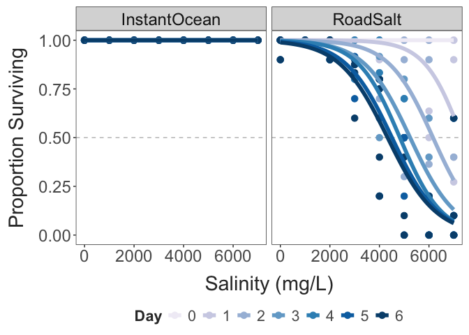

``` r
# surv_obj = Surv(surv_data$hour, surv_data$ind_surv)
# surv_fit = survfit2(Surv(hour, ind_surv) ~ treatment + salt, data = surv_data)
# 
# #summary(surv_fit_2)
# 
# ggsurvplot_facet(surv_fit, 
#                  data = surv_data,
#                  facet.by = "salt",
#                  conf.int=T, pval=F, risk.table=F, 
#                  conf.int.alpha = 0.1,
#                  size = 2,
#                  palette = "YlOrRd",
#                  legend.title="Salt Treatment")
```

### Skistodiaptomus oregonensis

``` r

oreg_data %>% 
  mutate(initial = hour_0) %>% 
  pivot_longer(cols = c("hour_0", "hour_18", "hour_42", "hour_62", "hour_86"), 
               names_to = "hour", 
               values_to = "individuals") %>% 
  mutate(prop_surv = individuals / initial) %>% 
  ggplot(aes(x = treatment, y = prop_surv, colour = sex)) +
  facet_wrap(hour~.) + 
  geom_point(position = position_jitter(height = 0.01, width = 200)) + 
  geom_smooth(method = "glm", 
              method.args = list(family = "binomial"), 
              se = FALSE,
              linewidth = 2) + 
  scale_colour_manual(values = c("female" = "lightcoral", 
                                 "male" = "lightblue3")) + 
  labs(x = "Salinity (mg/L)", 
       y = "Proportion Surviving") + 
  theme_matt_facets()
```

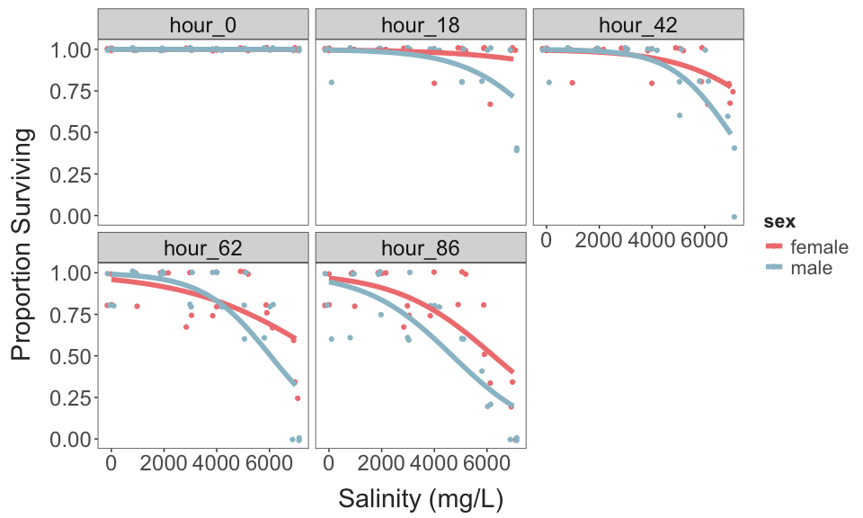

## CTmax Data

Shown below are the sample sizes for the various salt-treatment
combinations. Fewer experiments were run with Instant Ocean, so the
sample sizes are smaller for this salt.

``` r
ctmax_filtered = ctmax_data %>% 
  filter(!(experiment == 1 & experiment_date == "1/20/24")) %>% 
  filter(!(experiment_date == "2/3/24")) %>% 
  mutate("ID" = paste(salt, treatment, sep = " - ")) %>% 
  mutate(group = case_when(
    treatment == "control" ~ "control",
    treatment == "salt" ~ salt,
    treatment == "salt" ~ salt
  ))

knitr::kable(ctmax_filtered %>% 
               group_by(salt, treatment) %>%  
               count())
```

| salt         | treatment |   n |
|:-------------|:----------|----:|
| InstantOcean | control   |  10 |
| InstantOcean | salt      |  10 |
| RoadSalt     | control   |  20 |
| RoadSalt     | salt      |  20 |

A linear mixed effects model was used to examine variation in CTmax as a
function of salt type (Instant Ocean and road salt) and treatment
(control or salt-acclimated). We also examined the interaction between
these factors to determine whether the effect of treatment depended on
the type of salt used. Experiment date was included as a random effect
to control for any differences between collections or experimental
replicates.

``` r
salt.model = lmer(data = ctmax_filtered,
                  ctmax ~ treatment * salt + (1|experiment_date))

# salt.model = lm(data = ctmax_filtered,
#                 ctmax ~ treatment * salt)

knitr::kable(car::Anova(salt.model, type = "III"))
```

|                |       Chisq |  Df | Pr(\>Chisq) |
|:---------------|------------:|----:|------------:|
| (Intercept)    | 297.1864842 |   1 |   0.0000000 |
| treatment      |   0.9650063 |   1 |   0.3259287 |
| salt           |   0.0460898 |   1 |   0.8300127 |
| treatment:salt |  10.1836510 |   1 |   0.0014169 |

The mixed effects model indicates that there was a significant
interaction between salt type and treatment. We examined this
interaction by calculating the marginal treatment means by salt type.
Shown below, there was no significant difference between treatment
groups in the Instant Ocean experiments, but there was a substantial
difference between treatment groups in the road salt experiments.

``` r
salt.means = emmeans::emmeans(salt.model,
                              pairwise ~ treatment | salt)

knitr::kable(salt.means$contrasts)
```

| contrast       | salt         |   estimate |        SE |     df |    t.ratio |   p.value |
|:---------------|:-------------|-----------:|----------:|-------:|-----------:|----------:|
| control - salt | InstantOcean | -0.9290657 | 0.9457608 | 54.002 | -0.9823474 | 0.3303095 |
| control - salt | RoadSalt     |  2.7673322 | 0.6687539 | 54.002 |  4.1380427 | 0.0001234 |

``` r

treat_cols = c("salt" = "#95d5ce", "control" = "#028260")

ggplot(ctmax_filtered, aes(x = treatment, y = ctmax, fill = treatment)) +
  facet_wrap(salt~.) + 
  geom_boxplot(width = 0.5) +
  geom_point(size = 4, alpha = 0.5) + 
  scale_fill_manual(values = treat_cols) + 
  labs(x = "Treatment", 
       y = "CTmax (°C)") + 
  theme_matt_facets() + 
  theme(legend.position = "none",
        strip.background = element_rect(fill = "lightsalmon"),
        strip.text = element_text(margin = margin(0.7,0,0.7,0, "cm"),
                                  size = 20))
```

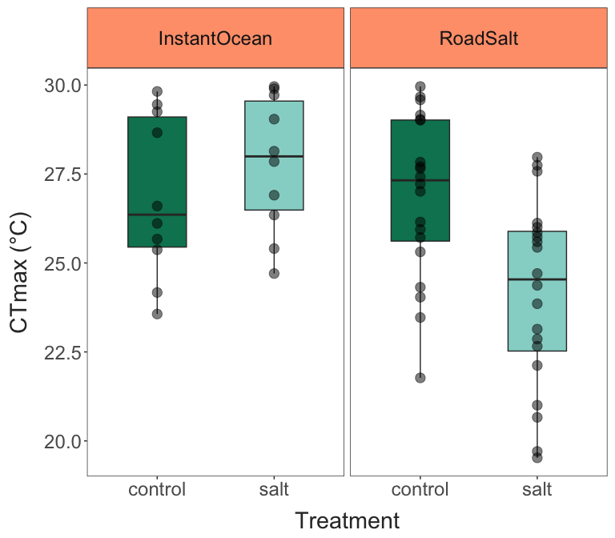

``` r

# ggplot(ctmax_filtered, aes(x = ctmax, fill = treatment)) + 
#   facet_wrap(salt~.) + 
#   geom_density(alpha = 0.5)
# 
# # Approach 1 - Simple t-test (comparison between two groups)
# t.test(data = filter(ctmax_filtered, salt == "RoadSalt"), ctmax ~ treatment)
```

## Ion Specific Patterns Across Seasons

``` r

ggplot(acclim_data, aes(x = size)) + 
  facet_wrap(species~.) + 
  geom_histogram(fill = "grey", colour = "grey30",
                 binwidth = 0.05) + 
  labs(x = "Body Size (mm)") + 
  theme_matt_facets()
```

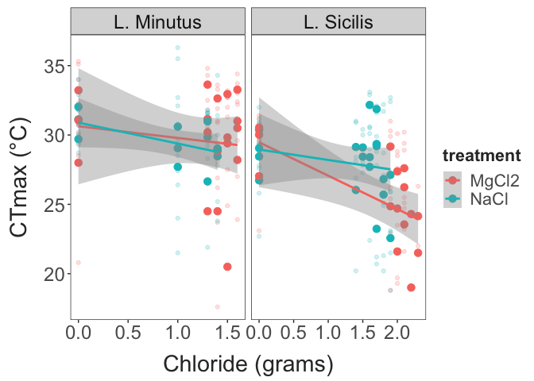

### Survival

The salinity treatments exhibit the expected survival curves, with
minimal acute effects, but strong effects emerging over five days.

``` r

surv_2025_data %>% 
  mutate(day = as.factor(day)) %>% 
  ggplot(aes(x = cl_conc, y = prop_surv, colour = day, group = day)) + 
  facet_grid(species ~ treatment) + 
  geom_hline(yintercept = 0.5, colour = "grey") + 
  geom_point(alpha = 0.5) + 
  geom_smooth(method = "glm",
              method.args = list(family = "quasibinomial"), 
              se = F, 
              linewidth = 2.5) + 
  scale_y_continuous(breaks = c(0,1)) + 
  scale_colour_brewer(palette = "RdBu", direction = -1) + 
  labs(x = "[Chloride] (g / L)", 
       y = "Proportion Surviving") + 
  theme_bw(base_size = 24) + 
  theme(panel.grid = element_blank())
```

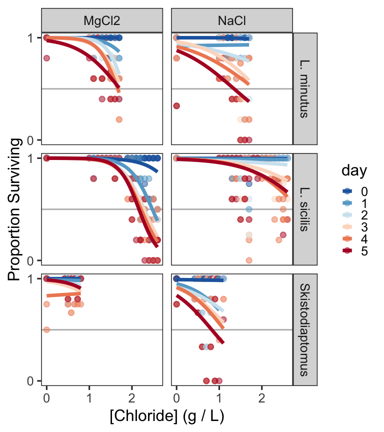

The survival curves were modeled as a logistic regression using a
generalized linear mixed effects model with a binomial link function.
The data was converted from group survival data (the number of
individuals surviving in each dish) to individual binary survival data
(1 = survived, 0 = dead), with the correct number of 1s and 0s based on
the group survival data.

``` r

surv_model_data = data.frame()
for(i in 1:dim(surv_2025_data)[1]){
  conditions = surv_2025_data[i,] %>% 
    dplyr::select(treatment, species, collection_date, collection_temp, cl_conc, time, day)
  
  if(conditions$species != "Skistodiaptomus"){
    initial = surv_2025_data$initial[i]
    surviving = surv_2025_data$surviving[i]
    dead = initial - surviving
    individual = c(1:initial)
    
    binary_data = data.frame("individual" = individual, 
                             "surv" = rep(c(1,0), times = c(surviving, dead)))
    
    day_data = bind_cols(conditions, binary_data) %>% 
      mutate(mort = if_else(surv == 1, 0, 1))
    
    surv_model_data = bind_rows(surv_model_data, day_data)
    
  }
  
}  

surv.model = glmmTMB::glmmTMB(surv ~ species * treatment * cl_conc * day +  (1 | collection_date), 
                              data = surv_model_data, 
                              family = binomial)


# 
# 
# performance::check_model(surv.model)
```

``` r

summary(surv.model)
##  Family: binomial  ( logit )
## Formula:          surv ~ species * treatment * cl_conc * day + (1 | collection_date)
## Data: surv_model_data
## 
##       AIC       BIC    logLik -2*log(L)  df.resid 
##    2994.9    3109.2   -1480.4    2960.9      6127 
## 
## Random effects:
## 
## Conditional model:
##  Groups          Name        Variance Std.Dev.
##  collection_date (Intercept) 5.339    2.311   
## Number of obs: 6144, groups:  collection_date, 23
## 
## Conditional model:
##                                             Estimate Std. Error z value Pr(>|z|)    
## (Intercept)                                  10.4562     2.5317   4.130 3.63e-05 ***
## speciesL. sicilis                            -4.0204     2.8277  -1.422 0.155088    
## treatmentNaCl                                -2.1885     2.7583  -0.793 0.427533    
## cl_conc                                      -4.8947     1.4131  -3.464 0.000532 ***
## day                                          -1.1254     0.5542  -2.031 0.042287 *  
## speciesL. sicilis:treatmentNaCl               4.9417     3.3624   1.470 0.141646    
## speciesL. sicilis:cl_conc                     2.2504     1.4964   1.504 0.132603    
## treatmentNaCl:cl_conc                         3.9546     1.5366   2.574 0.010064 *  
## speciesL. sicilis:day                         1.5634     0.6486   2.410 0.015936 *  
## treatmentNaCl:day                             0.7048     0.6016   1.171 0.241443    
## cl_conc:day                                   0.3558     0.3697   0.963 0.335789    
## speciesL. sicilis:treatmentNaCl:cl_conc      -3.5047     1.8300  -1.915 0.055473 .  
## speciesL. sicilis:treatmentNaCl:day          -1.0907     0.7781  -1.402 0.161011    
## speciesL. sicilis:cl_conc:day                -0.7709     0.3998  -1.928 0.053828 .  
## treatmentNaCl:cl_conc:day                    -0.6025     0.4103  -1.468 0.142028    
## speciesL. sicilis:treatmentNaCl:cl_conc:day   0.5141     0.4794   1.072 0.283510    
## ---
## Signif. codes:  0 '***' 0.001 '**' 0.01 '*' 0.05 '.' 0.1 ' ' 1

performance::r2_nakagawa(surv.model)
## # R2 for Mixed Models
## 
##   Conditional R2: 0.824
##      Marginal R2: 0.539
# Conditional = variance explained by both fixed and random effects
```

``` r

car::Anova(surv.model, type = "III") %>% knitr::kable()
```

|                               |      Chisq |  Df | Pr(\>Chisq) |
|:------------------------------|-----------:|----:|------------:|
| (Intercept)                   | 17.0571380 |   1 |   0.0000363 |
| species                       |  2.0214754 |   1 |   0.1550884 |
| treatment                     |  0.6295157 |   1 |   0.4275330 |
| cl_conc                       | 11.9986125 |   1 |   0.0005324 |
| day                           |  4.1236820 |   1 |   0.0422869 |
| species:treatment             |  2.1599869 |   1 |   0.1416459 |
| species:cl_conc               |  2.2617628 |   1 |   0.1326030 |
| treatment:cl_conc             |  6.6234854 |   1 |   0.0100643 |
| species:day                   |  5.8099437 |   1 |   0.0159358 |
| treatment:day                 |  1.3721509 |   1 |   0.2414427 |
| cl_conc:day                   |  0.9264409 |   1 |   0.3357895 |
| species:treatment:cl_conc     |  3.6678200 |   1 |   0.0554727 |
| species:treatment:day         |  1.9647048 |   1 |   0.1610110 |
| species:cl_conc:day           |  3.7180214 |   1 |   0.0538281 |
| treatment:cl_conc:day         |  2.1558436 |   1 |   0.1420284 |
| species:treatment:cl_conc:day |  1.1501878 |   1 |   0.2835098 |

To clarify the patterns, we further analyzed the data using 1) model
predictions of survival, 2) a Kaplan-Meier survival analysis, and 3)
estimates of LC50 (the chloride concentration inducing 50% mortality).

### Model Predictions

The generalized linear mixed model described above was used to predict
survival data for the two species exposed to a range of chloride
concentrations (0 - 3 g chloride), for 0-10 days. The predictions assume
a collection temperature of 10°C and a collection date in mid-March.

The predicted survival values reinforce the main points from the raw
survival data:

1.  L. minutus has a higher salt tolerance than L. sicilis.
2.  Both species are more sensitive to MgCl2 than NaCl.
3.  Survival decreases rapidly at higher chloride concentrations, but
    this varies across salts and species.

``` r

pred_conc = rep(seq(from = 0, to = 3, by = 0.01), times = 4)
pred_treatments = rep(c("MgCl2", "NaCl"), times = length(pred_conc) / 2)
pred_species = rep(c("L. minutus", "L. sicilis"), each = length(pred_conc) / 2)

pred_data = data.frame(species = pred_species, 
                       treatment = pred_treatments, 
                       cl_conc = pred_conc, 
                       collection_temp = 10, 
                       day = rep(c(0:10), each = length(pred_species)), 
                       collection_date = "2026-03-16") %>% 
  mutate(surv = predict(surv.model, newdata = ., type="response"))

ggplot(pred_data, aes(x = cl_conc, y = surv, colour = day, group = day)) + 
  facet_grid(treatment~species) + 
  geom_line(linewidth = 2) + 
  scale_color_viridis_c(option = "G", direction = -1) + 
  theme_matt_facets()
```

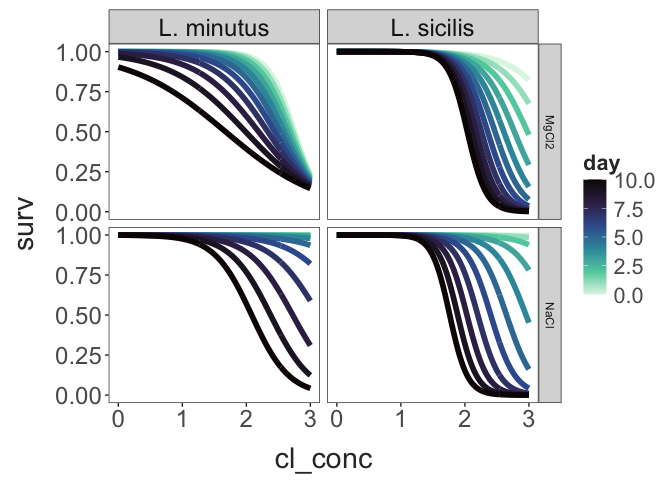

### LC50 Values

We subset the data for each species, treatment, and day. We fit a
logistic regression to each subset, and then estimated the LC50
(chloride concentration where 50% mortality is observed). These LC50
values are shown below. Note: the NaCl LC50 value for L. sicilis on Day
1 is ~25 g Chloride, but has been cut off to highlight the patterns on
later days.

``` r

salt_cols = c("MgCl2" = "#761968", 
              "NaCl" = "#32ad3a")

# 2. Map model and dose.p to each nested data frame
lc50_values = surv_model_data %>%
  filter(day != 0) %>% 
  group_by(treatment, species, day) %>%
  nest() %>%
  mutate(
    model = map(data, ~glm(surv ~ cl_conc, # Fit logistic regression
                         data = .x, family = binomial)),
    lc50 = map(model, ~dose.p(.x, p = 0.5))) %>% # Extract dose.p for specific probability (e.g., 0.50 for LD50)
  dplyr::select(treatment, species, day, lc50) %>% 
  hoist(lc50, "p = 0.5:") %>%  
  dplyr::select(treatment:day, "lc50" = `p = 0.5:`)

lc50_values %>% 
ggplot(aes(x = day, y = lc50, colour = treatment)) + 
  facet_grid(treatment ~ species) + 
  geom_hline(yintercept = 0) + 
  geom_line(linewidth = 2) + 
  geom_point(size = 3) + 
  scale_color_manual(values = salt_cols) + 
  coord_cartesian(ylim = c(0,10)) + 
  theme_matt_facets() + 
  theme(legend.position = "none")
```

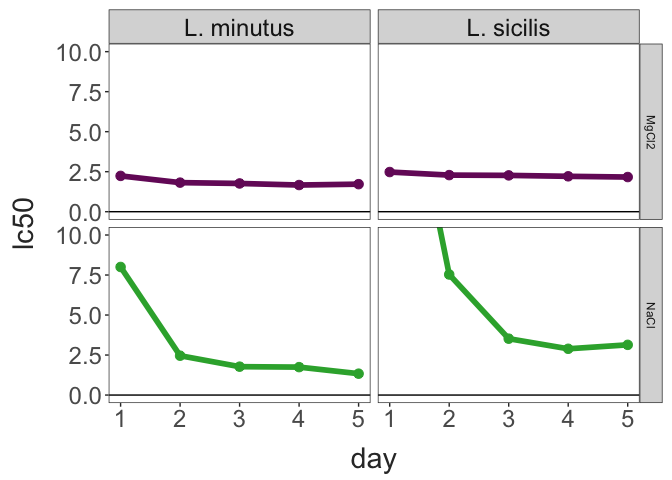

### Thermal Limit Effects

Shown below are the average CTmax values for each chloride concentration
(one mean per species, ion, and collection date combination). While salt
acclimation has minimal effects on L. minutus, MgCl2 acclimation seems
to have strong negative effects on L. sicilis. Note that the x-axis
differs slightly between species.

``` r

acclim_data %>% 
  group_by(species, 
           collection_date, 
           treatment, 
           cl_conc) %>% 
  summarise(mean_ctmax = mean(ctmax)) %>% 
  ggplot(aes(x = cl_conc, y = mean_ctmax, colour = treatment)) + 
  facet_wrap(.~species, scales = "free_x") + 
  geom_point(data = acclim_data, aes(x = cl_conc, y = ctmax, colour = treatment), 
             alpha = 0.2) + 
  geom_point(size = 3) + 
  geom_smooth(method = "lm", linewidth = 2) + 
  scale_colour_manual(values = salt_cols) + 
  scale_x_continuous(breaks = c(0,1,2), 
                     labels = c("0", "1", "2")) + 
  labs(y = "CTmax (°C)", 
       x = "Chloride (grams)") + 
  theme_matt_facets()
```

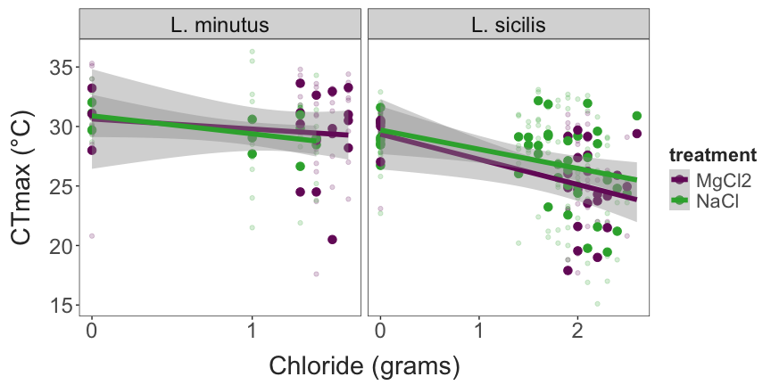

These same effects can be shown against the proportional mortality -
this is meant to provide a standardized metric for “stress” of exposure
to these different salts.

``` r

surv_ctmax = acclim_data %>% 
  group_by(species, 
           collection_date, 
           treatment, 
           cl_conc) %>% 
  summarise(mean_ctmax = mean(ctmax)) %>% 
  mutate(collection_date = as_date(collection_date))

surv_surv = surv_2025_data %>% 
  group_by(treatment, species, collection_date) %>% 
  filter(time == max(time))

left_join(surv_ctmax, surv_surv) %>% 
  mutate(prop_mort = 1 - prop_surv) %>% 
  ggplot(aes(x = prop_mort, y = mean_ctmax, colour = treatment)) + 
  facet_wrap(.~species) + 
  geom_point(size = 3) +
  geom_smooth(method = "lm", linewidth = 2) + 
  scale_colour_manual(values = salt_cols) + 
  labs(y = "Mean CTmax (°C)", 
       x = "Proportion Mortality") + 
  scale_x_continuous(breaks = c(0,0.5,1), 
                     labels = c("0", "0.5", "1")) +
  theme_matt_facets()
```

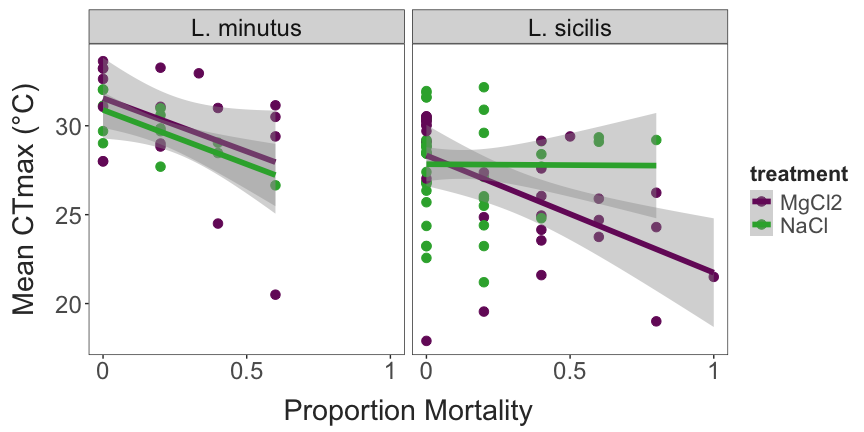

We modeled these effects using a mixed effects model, with CTmax as a
function of chloride concentration and salt compound (with interaction).
Species was also included as a fixed effect, while collection date and
tube position were included as random effects.

``` r
acclim_data.model = lmer(data = acclim_data, 
                         ctmax ~ cl_conc * treatment * species + size + (1|collection_date))
```

``` r
performance::check_model(acclim_data.model)
```

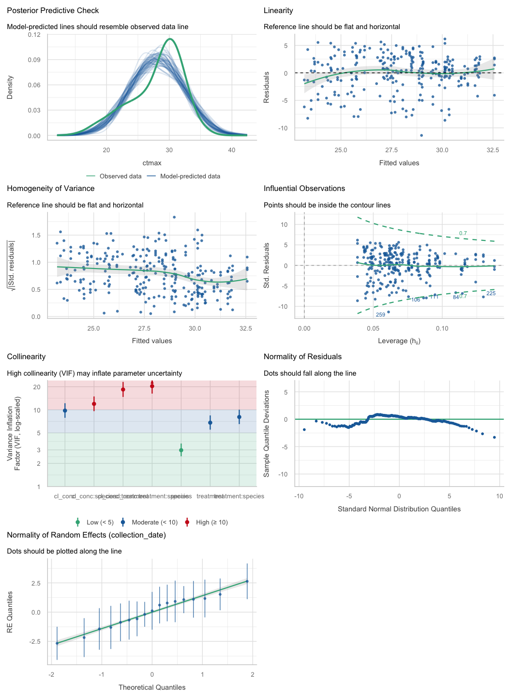

``` r

summary(acclim_data.model)
## Linear mixed model fit by REML. t-tests use Satterthwaite's method ['lmerModLmerTest']
## Formula: ctmax ~ cl_conc * treatment * species + size + (1 | collection_date)
##    Data: acclim_data
## 
## REML criterion at convergence: 911.4
## 
## Scaled residuals: 
##     Min      1Q  Median      3Q     Max 
## -3.3467 -0.5375  0.1672  0.6543  1.7902 
## 
## Random effects:
##  Groups          Name        Variance Std.Dev.
##  collection_date (Intercept)  3.777   1.943   
##  Residual                    11.528   3.395   
## Number of obs: 174, groups:  collection_date, 10
## 
## Fixed effects:
##                                         Estimate Std. Error       df t value Pr(>|t|)    
## (Intercept)                              31.6360     3.3515 115.4787   9.439 5.07e-16 ***
## cl_conc                                  -0.6280     0.9914 162.4035  -0.633    0.527    
## treatmentNaCl                             2.2856     1.9790 137.8412   1.155    0.250    
## speciesL. sicilis                        -0.9221     2.1729  31.7342  -0.424    0.674    
## size                                     -1.3673     4.1560 164.0438  -0.329    0.743    
## cl_conc:treatmentNaCl                    -1.3718     1.4528 162.1872  -0.944    0.346    
## cl_conc:speciesL. sicilis                -1.0116     1.1076 161.6353  -0.913    0.362    
## treatmentNaCl:speciesL. sicilis          -2.3238     2.5944 128.3888  -0.896    0.372    
## cl_conc:treatmentNaCl:speciesL. sicilis   1.0024     1.6400 161.6539   0.611    0.542    
## ---
## Signif. codes:  0 '***' 0.001 '**' 0.01 '*' 0.05 '.' 0.1 ' ' 1
## 
## Correlation of Fixed Effects:
##             (Intr) cl_cnc trtmNC spcL.s size   cl_:NC c_:L.s tNC:Ls
## cl_conc     -0.337                                                 
## treatmntNCl -0.377  0.688                                          
## specsL.scls -0.164  0.578  0.504                                   
## size        -0.863 -0.037  0.048 -0.267                            
## cl_cnc:trNC  0.174 -0.679 -0.802 -0.428  0.100                     
## cl_cnc:sL.s  0.315 -0.894 -0.617 -0.663  0.017  0.606              
## trtmnNC:L.s  0.285 -0.525 -0.763 -0.581 -0.034  0.612  0.596       
## cl_c:NC:L.s -0.198  0.600  0.713  0.474 -0.038 -0.881 -0.671 -0.773

performance::r2_nakagawa(acclim_data.model)
## # R2 for Mixed Models
## 
##   Conditional R2: 0.449
##      Marginal R2: 0.269
```

Marginal trends were calculated based on this model, representing the
effect of each salt type on CTmax (x axis shows the linear trend in
CTmax per unit increase in chloride - a negative trend indicates that
CTmax decreases as chloride concentrations increase). CTmax only seems
to decrease substantially when L. sicilis is exposed to MgCl2.

``` r
car::Anova(acclim_data.model, type = "III")
## Analysis of Deviance Table (Type III Wald chisquare tests)
## 
## Response: ctmax
##                             Chisq Df Pr(>Chisq)    
## (Intercept)               89.1009  1     <2e-16 ***
## cl_conc                    0.4013  1     0.5264    
## treatment                  1.3338  1     0.2481    
## species                    0.1801  1     0.6713    
## size                       0.1082  1     0.7422    
## cl_conc:treatment          0.8916  1     0.3451    
## cl_conc:species            0.8342  1     0.3611    
## treatment:species          0.8023  1     0.3704    
## cl_conc:treatment:species  0.3736  1     0.5411    
## ---
## Signif. codes:  0 '***' 0.001 '**' 0.01 '*' 0.05 '.' 0.1 ' ' 1

emmeans::emtrends(acclim_data.model, var = "cl_conc", specs = "treatment", by = "species") %>% 
  data.frame() %>% 
  ggplot(aes(x = treatment, y = cl_conc.trend, colour = treatment)) + 
  facet_wrap(species~.) + 
  geom_hline(yintercept = 0, colour = "grey") + 
  geom_point(size = 5, position = position_dodge(width = 1)) + 
  geom_errorbar(aes(ymin = lower.CL, ymax = upper.CL), 
                width = 0.1, linewidth = 2,
                position = position_dodge(width = 1)) + 
  scale_colour_manual(values = salt_cols) + 
  labs(x = "Salt", 
       y = "CTmax vs. Chloride Trend \n(°C / g Chloride)") + 
  coord_flip() + 
  theme_matt_facets() + 
  theme(legend.position = "none")
```

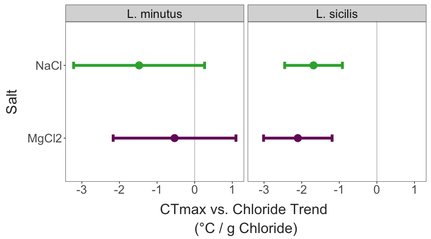
