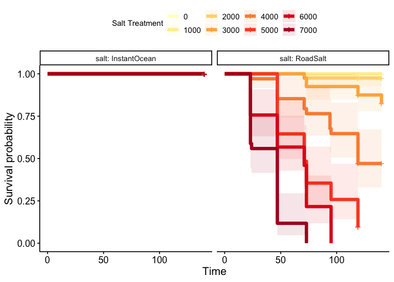
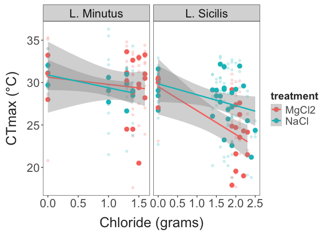
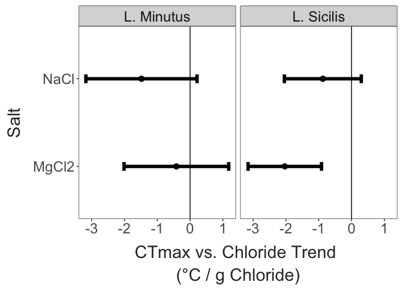
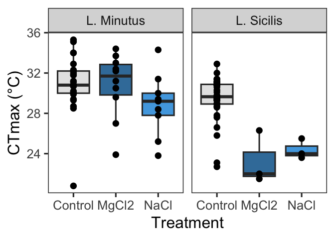
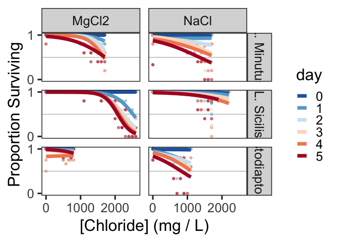

Effects of salinity acclimation on upper thermal limits of
*Leptodiaptomus sicilis*
================
2026-03-01

- [Survival Analyses](#survival-analyses)
  - [Skistodiaptomus oregonensis](#skistodiaptomus-oregonensis)
- [CTmax Data](#ctmax-data)
- [Ion Specific Patterns Across
  Seasons](#ion-specific-patterns-across-seasons)

## Survival Analyses

``` r
ggplot(daily_prop_data, aes(x = treatment, y = prop_surv, colour = factor(exp_day))) + 
  facet_wrap(salt~.) + 
  geom_hline(yintercept = 0.5,
             colour = "grey", 
             linetype = "dashed") + 
  geom_point(size = 3) + 
  geom_smooth(method = "glm", 
              method.args = list(family = "binomial"), 
              se = FALSE,
              linewidth = 2) + 
  scale_colour_brewer(type = "seq", palette = 9) + 
  guides(colour = guide_legend(nrow = 1)) + 
  labs(x = "Salinity (mg/L)",
       y = "Proportion Surviving",
       colour = "Day") + 
  theme_matt_facets() + 
  theme(legend.position = "bottom")
```


``` r
surv_obj = Surv(surv_data$hour, surv_data$ind_surv)
surv_fit = survfit2(Surv(hour, ind_surv) ~ treatment + salt, data = surv_data)

#summary(surv_fit_2)

ggsurvplot_facet(surv_fit, 
                 data = surv_data,
                 facet.by = "salt",
                 conf.int=T, pval=F, risk.table=F, 
                 conf.int.alpha = 0.1,
                 size = 2,
                 palette = "YlOrRd",
                 legend.title="Salt Treatment")
```



### Skistodiaptomus oregonensis

``` r

oreg_data %>% 
  mutate(initial = hour_0) %>% 
  pivot_longer(cols = c("hour_0", "hour_18", "hour_42", "hour_62", "hour_86"), 
               names_to = "hour", 
               values_to = "individuals") %>% 
  mutate(prop_surv = individuals / initial) %>% 
  ggplot(aes(x = treatment, y = prop_surv, colour = sex)) +
  facet_wrap(hour~.) + 
  geom_point(position = position_jitter(height = 0.01, width = 200)) + 
  geom_smooth(method = "glm", 
              method.args = list(family = "binomial"), 
              se = FALSE,
              linewidth = 2) + 
  scale_colour_manual(values = c("female" = "lightcoral", 
                                 "male" = "lightblue3")) + 
  labs(x = "Salinity (mg/L)", 
       y = "Proportion Surviving") + 
  theme_matt_facets()
```


## CTmax Data

Shown below are the sample sizes for the various salt-treatment
combinations. Fewer experiments were run with Instant Ocean, so the
sample sizes are smaller for this salt.

``` r
ctmax_filtered = ctmax_data %>% 
  filter(!(experiment == 1 & experiment_date == "1/20/24")) %>% 
  filter(!(experiment_date == "2/3/24")) %>% 
  mutate("ID" = paste(salt, treatment, sep = " - ")) %>% 
  mutate(group = case_when(
    treatment == "control" ~ "control",
    treatment == "salt" ~ salt,
    treatment == "salt" ~ salt
  ))

knitr::kable(ctmax_filtered %>% 
               group_by(salt, treatment) %>%  
               count())
```

| salt         | treatment |   n |
|:-------------|:----------|----:|
| InstantOcean | control   |  10 |
| InstantOcean | salt      |  10 |
| RoadSalt     | control   |  20 |
| RoadSalt     | salt      |  20 |

A linear mixed effects model was used to examine variation in CTmax as a
function of salt type (Instant Ocean and road salt) and treatment
(control or salt-acclimated). We also examined the interaction between
these factors to determine whether the effect of treatment depended on
the type of salt used. Experiment date was included as a random effect
to control for any differences between collections or experimental
replicates.

``` r
salt.model = lmer(data = ctmax_filtered,
                  ctmax ~ treatment * salt + (1|experiment_date))

# salt.model = lm(data = ctmax_filtered,
#                 ctmax ~ treatment * salt)

knitr::kable(car::Anova(salt.model, type = "III"))
```

|                |       Chisq |  Df | Pr(\>Chisq) |
|:---------------|------------:|----:|------------:|
| (Intercept)    | 297.1864842 |   1 |   0.0000000 |
| treatment      |   0.9650063 |   1 |   0.3259287 |
| salt           |   0.0460898 |   1 |   0.8300127 |
| treatment:salt |  10.1836510 |   1 |   0.0014169 |

The mixed effects model indicates that there was a significant
interaction between salt type and treatment. We examined this
interaction by calculating the marginal treatment means by salt type.
Shown below, there was no significant difference between treatment
groups in the Instant Ocean experiments, but there was a substantial
difference between treatment groups in the road salt experiments.

``` r
salt.means = emmeans::emmeans(salt.model,
                              pairwise ~ treatment | salt)

knitr::kable(salt.means$contrasts)
```

| contrast       | salt         |   estimate |        SE |     df |    t.ratio |   p.value |
|:---------------|:-------------|-----------:|----------:|-------:|-----------:|----------:|
| control - salt | InstantOcean | -0.9290657 | 0.9457608 | 54.002 | -0.9823474 | 0.3303095 |
| control - salt | RoadSalt     |  2.7673322 | 0.6687539 | 54.002 |  4.1380427 | 0.0001234 |

``` r

treat_cols = c("salt" = "#95d5ce", "control" = "#028260")

ggplot(ctmax_filtered, aes(x = treatment, y = ctmax, fill = treatment)) +
  facet_wrap(salt~.) + 
  geom_boxplot(width = 0.5) +
  geom_point(size = 4, alpha = 0.5) + 
  scale_fill_manual(values = treat_cols) + 
  labs(x = "Treatment", 
       y = "CTmax (°C)") + 
  theme_matt_facets() + 
  theme(legend.position = "none",
        strip.background = element_rect(fill = "lightsalmon"),
        strip.text = element_text(margin = margin(0.7,0,0.7,0, "cm"),
                                  size = 20))
```


``` r

# ggplot(ctmax_filtered, aes(x = ctmax, fill = treatment)) + 
#   facet_wrap(salt~.) + 
#   geom_density(alpha = 0.5)
# 
# # Approach 1 - Simple t-test (comparison between two groups)
# t.test(data = filter(ctmax_filtered, salt == "RoadSalt"), ctmax ~ treatment)
```

## Ion Specific Patterns Across Seasons

Shown below are the average CTmax values for each chloride concentration
(one mean per species, ion, and collection date combination). While salt
acclimation has minimal effects on L. minutus, MgCl2 acclimation seems
to have strong negative effects on L. sicilis. Note that the x-axis
differs slightly between species.

``` r
acclim_data %>% 
  group_by(species, 
           collection_date, 
           treatment, 
           cl_conc) %>% 
  summarise(mean_ctmax = mean(ctmax)) %>% 
  ggplot(aes(x = cl_conc, y = mean_ctmax, colour = treatment)) + 
  facet_wrap(.~species, scales = "free_x") + 
  geom_point(data = acclim_data, aes(x = cl_conc, y = ctmax, colour = treatment), 
             alpha = 0.2) + 
  geom_point(size = 3) + 
  geom_smooth(method = "lm") + 
  labs(y = "CTmax (°C)", 
       x = "Chloride (grams)") + 
  theme_matt_facets()
```


We modeled these effects using a mixed effects model, with CTmax as a
function of chloride concentration and salt compound (with interaction).
Species was also included as a fixed effect, while collection date and
tube position were included as random effects.

``` r
acclim_data.model = lme4::lmer(data = acclim_data, 
                               ctmax ~ cl_conc * treatment * species + (1|collection_date) + (1|tube))

performance::check_model(acclim_data.model)
```



Marginal trends were calculated based on this model, representing the
effect of each salt type on CTmax (x axis shows the linear trend in
CTmax per unit increase in chloride - a negative trend indicates that
CTmax decreases as chloride concentrations increase). CTmax only seems
to decrease substantially when L. sicilis is exposed to MgCl2.

``` r
#car::Anova(acclim_data.model, test = "F")

emmeans::emtrends(acclim_data.model, specs = "treatment", by = "species", var = "cl_conc") %>% 
  data.frame() %>% 
  ggplot(aes(x = treatment, y = cl_conc.trend)) + 
  facet_wrap(species~.) + 
  geom_hline(yintercept = 0) + 
  geom_point(size = 3, position = position_dodge(width = 1)) + 
  geom_errorbar(aes(ymin = lower.CL, ymax = upper.CL), 
                width = 0.1, linewidth = 2,
                position = position_dodge(width = 1)) + 
  labs(x = "Salt", 
       y = "CTmax vs. Chloride Trend \n(°C / g Chloride)") + 
  coord_flip() + 
  theme_matt_facets()
```



In case salt concentration exhibits threshold effects, we also looked at
the change in CTmax between the control and the maximum salt
concentration for each treatment. These chloride concentrations differ
across species and salt, and are shown below.

``` r
acclim_data %>% 
  group_by(treatment, species) %>% 
  filter(cl_conc == max(cl_conc)) %>% 
  select(species, treatment, cl_conc) %>% distinct() %>% 
  knitr::kable()
```

| species    | treatment | cl_conc |
|:-----------|:----------|--------:|
| L. Sicilis | NaCl      |     1.9 |
| L. Sicilis | MgCl2     |     2.3 |
| L. Minutus | NaCl      |     1.4 |
| L. Minutus | MgCl2     |     1.6 |

These comparisons highlight several interesting facets. First, the
different salts seem to have different relative effects depending on the
species: NaCl has a slightly larger effect on CTmax than MgCl2 in L.
minutus, while the opposite is observed for L. sicilis (although the
effects of NaCl on CTmax in this species are highly variable). Second,
we see that both salts seem to have a stronger effect on L. sicilis than
on L. minutus.

``` r
max_comps = acclim_data %>% 
  group_by(treatment, species) %>% 
  filter(cl_conc == max(cl_conc) | cl_conc == 0) %>% 
  mutate(salt = if_else(cl_conc > 0, treatment, "Control"))

# max_comps %>% 
#   group_by(salt, species, collection_date, cl_conc) %>% 
#   summarise(mean_ctmax = mean(ctmax), 
#             ctmax_se = sd(ctmax) / sqrt(n())) %>% 
#   ggplot(aes(x = cl_conc, y = mean_ctmax, colour = salt)) + 
#   facet_wrap(.~species) + 
#   geom_point()

### CTmax boxplots - save as 7x6"
ggplot(max_comps, aes(x = salt, y = ctmax, fill = salt)) + 
  facet_wrap(species~.) + 
  geom_boxplot()+ 
  geom_point() + 
  labs(y = "CTmax (°C)", 
       x = "Treatment") + 
  scale_fill_manual(values = c("Control" = "grey90",
                               "MgCl2" = "#3C7DA9",
                               "NaCl" = "#50A8E2")) + 
  theme_bw(base_size = 24) + 
  theme(panel.grid = element_blank(),
        legend.position = "none")
```


Again, we will model the CTmax data using a mixed effects model, with
interacting fixed effects of treatment (control, maximum NaCl, maximum
MgCl2) and species, and random effects of collection date and tube
position.

``` r
max_comp.model = lme4::lmer(data = max_comps, 
                            ctmax ~ salt * species + (1|collection_date) + (1|tube))

performance::check_model(max_comp.model)
```


Using this model we calculate estimated marginal means comparing the
control to the salt treatment for both species. Here again we see that
there are no major effects of salt acclimation on thermal limits in L.
minutus, while salt acclimation reduced thermal limits in L. sicilis,
with a stronger decrease in response to MgCl2 than NaCl.

``` r
car::Anova(max_comp.model, test = "F")
## Analysis of Deviance Table (Type II Wald F tests with Kenward-Roger df)
## 
## Response: ctmax
##                   F Df Df.res   Pr(>F)   
## salt         5.7141  2 72.056 0.004973 **
## species      9.1693  1  9.802 0.012999 * 
## salt:species 3.7692  2 71.738 0.027764 * 
## ---
## Signif. codes:  0 '***' 0.001 '**' 0.01 '*' 0.05 '.' 0.1 ' ' 1

### Contrasts plot - save as 5x8"
emmeans::emmeans(max_comp.model, ~ salt, by = "species") %>% 
  emmeans::contrast(method="trt.vs.ctrl") %>% 
  data.frame() %>% 
  ggplot(aes(x = contrast, y = estimate)) + 
  facet_wrap(species~.) + 
  geom_hline(yintercept = 0) + 
  geom_point(size = 3) + 
  geom_errorbar(aes(ymin = estimate - 1.96*SE, ymax = estimate + 1.96*SE), 
                width = 0.1, linewidth = 2,
                position = position_dodge(width = 1)) + 
  labs(x = "Comparison", 
       y = "CTmax Effect (°C)") + 
  coord_flip() + 
  theme_matt_facets()
```



``` r

surv_2025_data %>% 
  mutate(day = as.factor(day)) %>% 
  ggplot(aes(x = cl_conc, y = prop_surv, colour = day, group = day)) + 
  facet_grid(species ~ treatment) + 
  geom_hline(yintercept = 0.5, colour = "grey") + 
  geom_point(alpha = 0.5) + 
  geom_smooth(method = "glm",
              method.args = list(family = "quasibinomial"), 
              se = F, 
              linewidth = 2.5) + 
  scale_y_continuous(breaks = c(0,1)) + 
  scale_colour_brewer(palette = "RdBu", direction = -1) + 
  labs(x = "[Chloride] (mg / L)", 
       y = "Proportion Surviving") + 
  theme_bw(base_size = 24) + 
  theme(panel.grid = element_blank())
```


