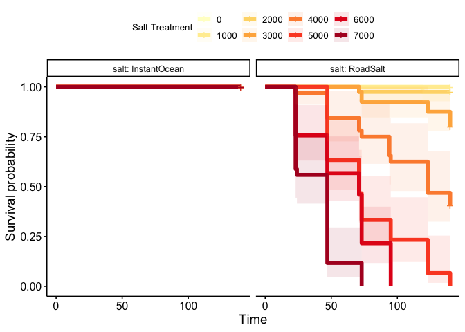

Effects of salinity acclimation on upper thermal limits of
*Leptodiaptomus sicilis*
================
2025-03-30

- [Survival Analyses](#survival-analyses)
  - [Skistodiaptomus oregonensis](#skistodiaptomus-oregonensis)
- [CTmax Data](#ctmax-data)

## Survival Analyses

``` r
ggplot(daily_prop_data, aes(x = treatment, y = prop_surv, colour = factor(exp_day))) + 
  facet_wrap(salt~.) + 
  geom_hline(yintercept = 0.5,
             colour = "grey", 
             linetype = "dashed") + 
  geom_point(size = 3) + 
  geom_smooth(method = "glm", 
              method.args = list(family = "binomial"), 
              se = FALSE,
              linewidth = 2) + 
  scale_colour_brewer(type = "seq", palette = 9) + 
  guides(colour = guide_legend(nrow = 1)) + 
  labs(x = "Salinity (mg/L)",
       y = "Proportion Surviving",
       colour = "Day") + 
  theme_matt_facets() + 
  theme(legend.position = "bottom")
```


``` r
surv_obj = Surv(surv_data$hour, surv_data$ind_surv)
surv_fit = survfit2(Surv(hour, ind_surv) ~ treatment + salt, data = surv_data)

#summary(surv_fit_2)

ggsurvplot_facet(surv_fit, 
                 data = surv_data,
                 facet.by = "salt",
                 conf.int=T, pval=F, risk.table=F, 
                 conf.int.alpha = 0.1,
                 size = 2,
                 palette = "YlOrRd",
                 legend.title="Salt Treatment")
```



### Skistodiaptomus oregonensis

``` r

oreg_data %>% 
  mutate(initial = hour_0) %>% 
  pivot_longer(cols = c("hour_0", "hour_18", "hour_42", "hour_62", "hour_86"), 
               names_to = "hour", 
               values_to = "individuals") %>% 
  mutate(prop_surv = individuals / initial) %>% 
  ggplot(aes(x = treatment, y = prop_surv, colour = sex)) +
  facet_wrap(hour~.) + 
  geom_point(position = position_jitter(height = 0.01, width = 200)) + 
  geom_smooth(method = "glm", 
              method.args = list(family = "binomial"), 
              se = FALSE,
              linewidth = 2) + 
  scale_colour_manual(values = c("female" = "lightcoral", 
                                 "male" = "lightblue3")) + 
  labs(x = "Salinity (mg/L)", 
       y = "Proportion Surviving") + 
  theme_matt_facets()
```


## CTmax Data

Shown below are the sample sizes for the various salt-treatment
combinations. Fewer experiments were run with Instant Ocean, so the
sample sizes are smaller for this salt.

``` r
ctmax_filtered = ctmax_data %>% 
  filter(!(experiment == 1 & experiment_date == "1/20/24")) %>% 
  filter(!(experiment_date == "2/3/24")) %>% 
  mutate("ID" = paste(salt, treatment, sep = " - ")) %>% 
  mutate(group = case_when(
    treatment == "control" ~ "control",
    treatment == "salt" ~ salt,
    treatment == "salt" ~ salt
  ))

knitr::kable(ctmax_filtered %>% 
               group_by(salt, treatment) %>%  
               count())
```

| salt         | treatment |   n |
|:-------------|:----------|----:|
| InstantOcean | control   |  10 |
| InstantOcean | salt      |  10 |
| RoadSalt     | control   |  20 |
| RoadSalt     | salt      |  20 |

A linear mixed effects model was used to examine variation in CTmax as a
function of salt type (Instant Ocean and road salt) and treatment
(control or salt-acclimated). We also examined the interaction between
these factors to determine whether the effect of treatment depended on
the type of salt used. Experiment date was included as a random effect
to control for any differences between collections or experimental
replicates.

``` r
salt.model = lmer(data = ctmax_filtered,
                  ctmax ~ treatment * salt + (1|experiment_date))

# salt.model = lm(data = ctmax_filtered,
#                 ctmax ~ treatment * salt)

knitr::kable(car::Anova(salt.model, type = "III"))
```

|                |       Chisq |  Df | Pr(\>Chisq) |
|:---------------|------------:|----:|------------:|
| (Intercept)    | 297.1864842 |   1 |   0.0000000 |
| treatment      |   0.9650063 |   1 |   0.3259287 |
| salt           |   0.0460898 |   1 |   0.8300127 |
| treatment:salt |  10.1836510 |   1 |   0.0014169 |

The mixed effects model indicates that there was a significant
interaction between salt type and treatment. We examined this
interaction by calculating the marginal treatment means by salt type.
Shown below, there was no significant difference between treatment
groups in the Instant Ocean experiments, but there was a substantial
difference between treatment groups in the road salt experiments.

``` r
salt.means = emmeans::emmeans(salt.model,
                              pairwise ~ treatment | salt)

knitr::kable(salt.means$contrasts)
```

| contrast       | salt         |   estimate |        SE |     df |    t.ratio |   p.value |
|:---------------|:-------------|-----------:|----------:|-------:|-----------:|----------:|
| control - salt | InstantOcean | -0.9290657 | 0.9457608 | 54.002 | -0.9823474 | 0.3303095 |
| control - salt | RoadSalt     |  2.7673322 | 0.6687539 | 54.002 |  4.1380427 | 0.0001234 |

``` r

treat_cols = c("salt" = "#95d5ce", "control" = "#028260")

ggplot(ctmax_filtered, aes(x = treatment, y = ctmax, fill = treatment)) +
  facet_wrap(salt~.) + 
  geom_boxplot(width = 0.5) +
  geom_point(size = 4, alpha = 0.5) + 
  scale_fill_manual(values = treat_cols) + 
  labs(x = "Treatment", 
       y = "CTmax (°C)") + 
  theme_matt_facets() + 
  theme(legend.position = "none",
        strip.background = element_rect(fill = "lightsalmon"),
        strip.text = element_text(margin = margin(0.7,0,0.7,0, "cm"),
                                  size = 20))
```


``` r

# ggplot(ctmax_filtered, aes(x = ctmax, fill = treatment)) + 
#   facet_wrap(salt~.) + 
#   geom_density(alpha = 0.5)
# 
# # Approach 1 - Simple t-test (comparison between two groups)
# t.test(data = filter(ctmax_filtered, salt == "RoadSalt"), ctmax ~ treatment)
```
