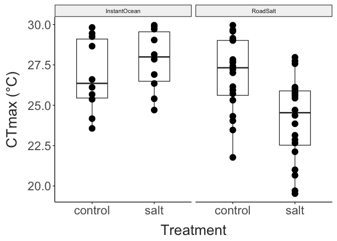

TITLE HERE
================
2024-02-01

- [Survival Analyses](#survival-analyses)
- [CTmax Data](#ctmax-data)

## Survival Analyses

``` r
ggplot(daily_prop_data, aes(x = treatment, y = prop_surv, colour = factor(exp_day))) + 
  facet_wrap(salt~.) + 
  geom_hline(yintercept = 0.5,
             colour = "grey", 
             linetype = "dashed") + 
  geom_point(size = 3) + 
  geom_smooth(method = "glm", 
              method.args = list(family = "binomial"), 
              se = FALSE,
              linewidth = 2) + 
  scale_colour_brewer(type = "seq", palette = 9) + 
  labs(x = "Salinity (mg/L)",
       y = "Proportion Surviving",
       colour = "Day") + 
  theme_matt()
```


``` r
surv_obj = Surv(surv_data$hour, surv_data$ind_surv)
surv_fit = survfit2(Surv(hour, ind_surv) ~ treatment + salt, data = surv_data)

#summary(surv_fit_2)

ggsurvplot_facet(surv_fit, 
                 data = surv_data,
                 facet.by = "salt",
                 conf.int=T, pval=F, risk.table=F, 
                 conf.int.alpha = 0.1,
                 size = 2,
                 palette = "YlOrRd",
                 legend.title="Salt Treatment")
```


``` r
cox.model = coxph(Surv(exp_day, ind_surv) ~ treatment + salt, data = surv_data)

cox.model
## Call:
## coxph(formula = Surv(exp_day, ind_surv) ~ treatment + salt, data = surv_data)
## 
##                   coef exp(coef)  se(coef)     z      p
## treatment    1.033e-03 1.001e+00 8.275e-05 12.49 <2e-16
## saltRoadSalt 2.127e+01 1.729e+09 2.143e+03  0.01  0.992
## 
## Likelihood ratio test=397.9  on 2 df, p=< 2.2e-16
## n= 447, number of events= 112

#ggforest(cox.model, data = surv_data)
```

## CTmax Data

``` r
ctmax_data %>%  
  mutate("ID" = paste(experiment_date, "- Exp.", experiment)) %>% 
  ggplot(aes(x = treatment, y = ctmax, fill = ID)) +
  facet_wrap(salt~.) +
  geom_boxplot(width = 0.5,
               position = position_dodge(width = 0.7)) +
  geom_point(size = 3,
             position = position_dodge(width = 0.7)) + 
  labs(x = "Treatment", 
       y = "CTmax (°C)") + 
  guides(fill = guide_legend(override.aes = list(shape = NA))) + 
  theme_matt() + 
  theme(legend.position = "right")
```


``` r
ctmax_filtered = ctmax_data %>% 
  filter(!(experiment == 1 & experiment_date == "1/20/24")) %>% 
  mutate("ID" = paste(salt, treatment, sep = " - ")) %>% 
  mutate(group = case_when(
    treatment == "control" ~ "control",
    treatment == "salt" ~ salt,
    treatment == "salt" ~ salt
  ))

knitr::kable(ctmax_filtered %>% 
               group_by(salt, treatment) %>%  
               count())
```

| salt         | treatment |   n |
|:-------------|:----------|----:|
| InstantOcean | control   |  10 |
| InstantOcean | salt      |  10 |
| RoadSalt     | control   |  10 |
| RoadSalt     | salt      |  10 |

``` r

# salt.model = lmer(data = ctmax_filtered, 
#                   ctmax ~ treatment * salt + (1 + treatment|experiment_date))

salt.model = lm(data = ctmax_filtered,
                ctmax ~ treatment * salt)

salt.model
## 
## Call:
## lm(formula = ctmax ~ treatment * salt, data = ctmax_filtered)
## 
## Coefficients:
##                (Intercept)               treatmentsalt                saltRoadSalt  
##                    26.8673                      0.9291                      0.8049  
## treatmentsalt:saltRoadSalt  
##                    -2.7594

car::Anova(salt.model, type = "III")
## Anova Table (Type III tests)
## 
## Response: ctmax
##                Sum Sq Df   F value  Pr(>F)    
## (Intercept)    7218.5  1 1872.3603 < 2e-16 ***
## treatment         4.3  1    1.1194 0.29709    
## salt              3.2  1    0.8401 0.36546    
## treatment:salt   19.0  1    4.9375 0.03265 *  
## Residuals       138.8 36                      
## ---
## Signif. codes:  0 '***' 0.001 '**' 0.01 '*' 0.05 '.' 0.1 ' ' 1

salt.means = emmeans::emmeans(salt.model,
                              pairwise ~ treatment | salt)

salt.means
## $emmeans
## salt = InstantOcean:
##  treatment emmean    SE df lower.CL upper.CL
##  control     26.9 0.621 36     25.6     28.1
##  salt        27.8 0.621 36     26.5     29.1
## 
## salt = RoadSalt:
##  treatment emmean    SE df lower.CL upper.CL
##  control     27.7 0.621 36     26.4     28.9
##  salt        25.8 0.621 36     24.6     27.1
## 
## Confidence level used: 0.95 
## 
## $contrasts
## salt = InstantOcean:
##  contrast       estimate    SE df t.ratio p.value
##  control - salt   -0.929 0.878 36  -1.058  0.2971
## 
## salt = RoadSalt:
##  contrast       estimate    SE df t.ratio p.value
##  control - salt    1.830 0.878 36   2.084  0.0443
```

``` r
ggplot(ctmax_filtered, aes(x = treatment, y = ctmax)) +
  facet_wrap(salt~.) + 
  geom_boxplot(width = 0.5) +
  geom_point(size = 4) + 
  labs(x = "Treatment", 
       y = "CTmax (°C)") + 
  theme_matt()
```



``` r
ggplot(ctmax_filtered, aes(x = treatment, y = ctmax, fill = treatment)) +
  facet_wrap(salt~.) + 
  geom_violin(draw_quantiles = c(0.25,0.75)) + 
  geom_point(size = 4) + 
  labs(x = "Treatment", 
       y = "CTmax (°C)") + 
  theme_matt()
```


``` r
mean_diff = load(ctmax_filtered, 
                 x = ID, y = ctmax,
  idx = list(
    c("InstantOcean - control", "InstantOcean - salt"),
    c("RoadSalt - control", "RoadSalt - salt"))) %>%
  mean_diff()

dabest_plot(mean_diff)
```


