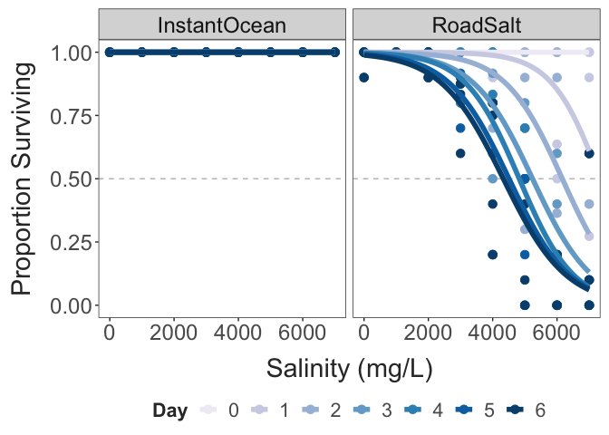

TITLE HERE
================
2024-01-21

- [Survival Analyses](#survival-analyses)
- [CTmax Data](#ctmax-data)

## Survival Analyses

``` r
ggplot(daily_prop_data, aes(x = treatment, y = prop_surv, colour = factor(hour))) + 
  geom_hline(yintercept = 0.5,
             colour = "grey", 
             linetype = "dashed") + 
  geom_point(size = 3) + 
  geom_smooth(method = "glm", 
              method.args = list(family = "binomial"), 
              se = FALSE,
              linewidth = 2) + 
  scale_colour_brewer(type = "seq", palette = 9) + 
  labs(x = "Salinity (mg/L)",
       y = "Proportion Surviving",
       colour = "Hour") + 
  theme_matt()
```



``` r
surv_obj = Surv(surv_data$hour, surv_data$ind_surv)
surv_fit = survfit2(Surv(hour, ind_surv) ~ treatment, data = surv_data)

#summary(surv_fit_2)

ggsurvplot(surv_fit, 
           conf.int=T, pval=F, risk.table=F, 
           conf.int.alpha = 0.1,
           size = 2,
           palette = "YlOrRd",
           legend.title="Salt Treatment")
```


``` r
cox.model = coxph(Surv(hour, ind_surv) ~ treatment + replicate, data = surv_data)

cox.model
## Call:
## coxph(formula = Surv(hour, ind_surv) ~ treatment + replicate, 
##     data = surv_data)
## 
##                 coef exp(coef)  se(coef)      z      p
## treatment  0.0010301 1.0010306 0.0001027 10.029 <2e-16
## replicateB 0.1985920 1.2196842 0.2484764  0.799  0.424
## 
## Likelihood ratio test=176.4  on 2 df, p=< 2.2e-16
## n= 144, number of events= 68
```

## CTmax Data

``` r
ctmax_data %>%  
  mutate("ID" = paste(experiment_date, "- Exp.", experiment)) %>% 
  ggplot(aes(x = treatment, y = ctmax, fill = ID)) +
  geom_boxplot(width = 0.5,
               position = position_dodge(width = 0.7)) +
  geom_point(size = 3,
             position = position_dodge(width = 0.7)) + 
  labs(x = "Treatment", 
       y = "CTmax (°C)") + 
  guides(fill = guide_legend(override.aes = list(shape = NA))) + 
  theme_matt() + 
  theme(legend.position = "right")
```


``` r
ctmax_filtered = ctmax_data %>% 
  filter(experiment == 2 | experiment_date == "1/13/24")

t.test(data = ctmax_filtered, 
       ctmax ~ treatment)
## 
##  Welch Two Sample t-test
## 
## data:  ctmax by treatment
## t = 2.2532, df = 17.648, p-value = 0.03722
## alternative hypothesis: true difference in means between group control and group salt is not equal to 0
## 95 percent confidence interval:
##  0.1212395 3.5394332
## sample estimates:
## mean in group control    mean in group salt 
##              27.67218              25.84184
```

``` r
ggplot(ctmax_filtered, aes(x = treatment, y = ctmax)) +
  geom_boxplot(width = 0.5) +
  geom_point(size = 4) + 
  labs(x = "Treatment", 
       y = "CTmax (°C)") + 
  theme_matt()
```


